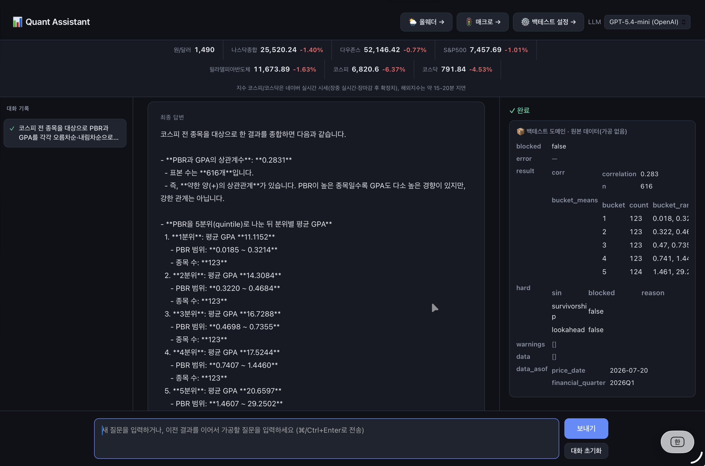
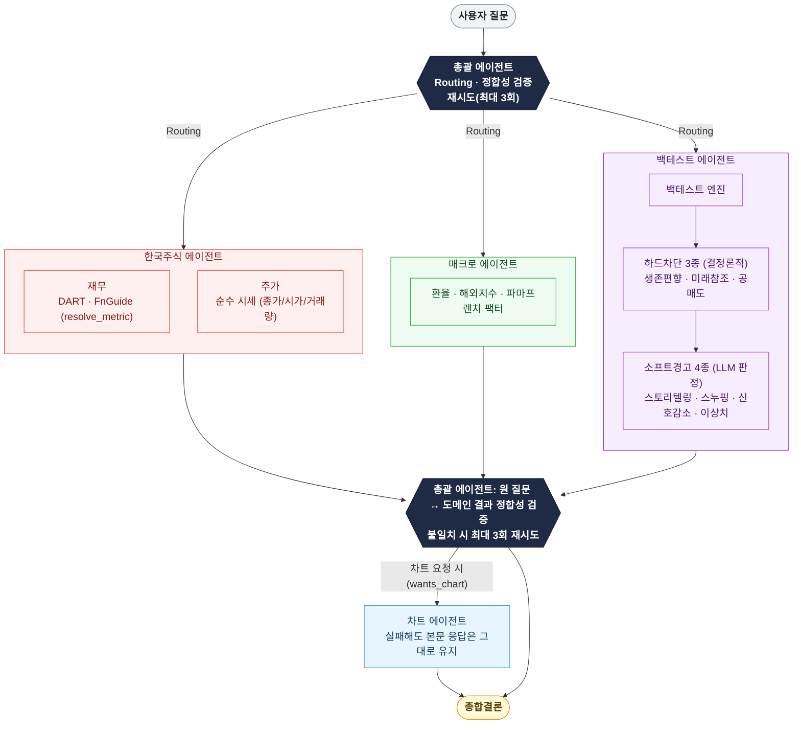
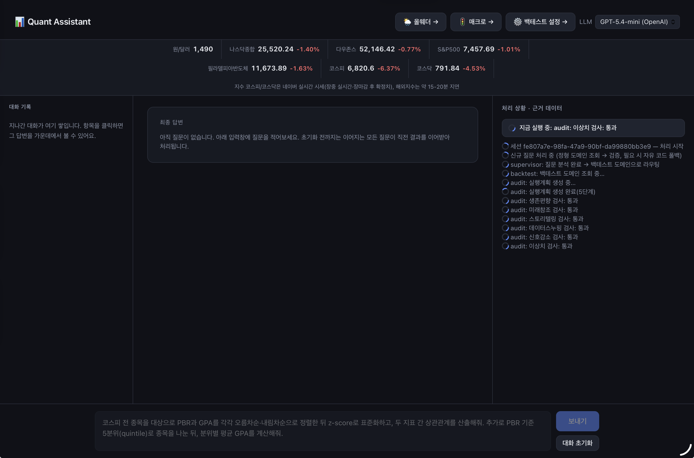
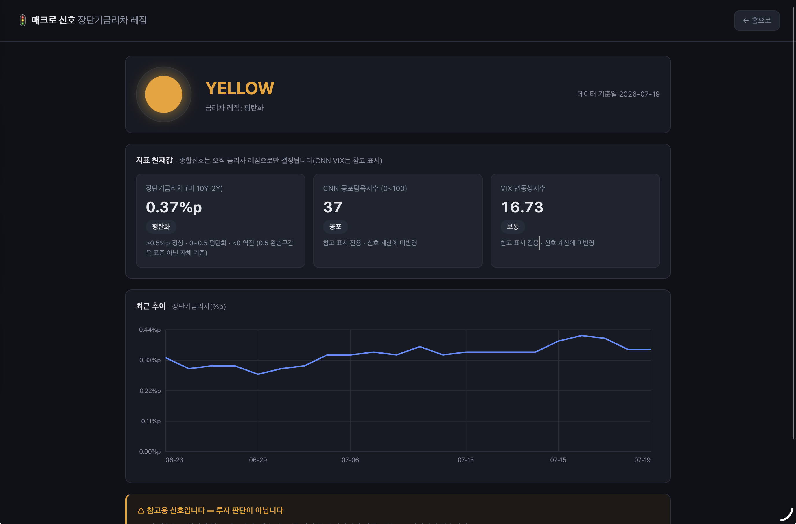
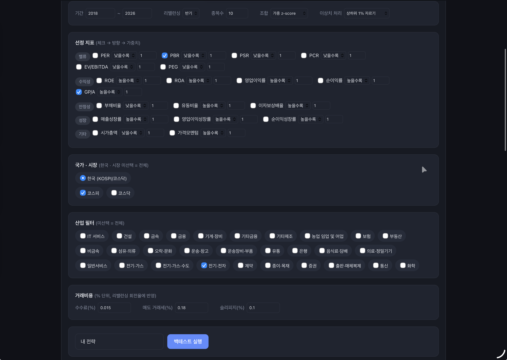
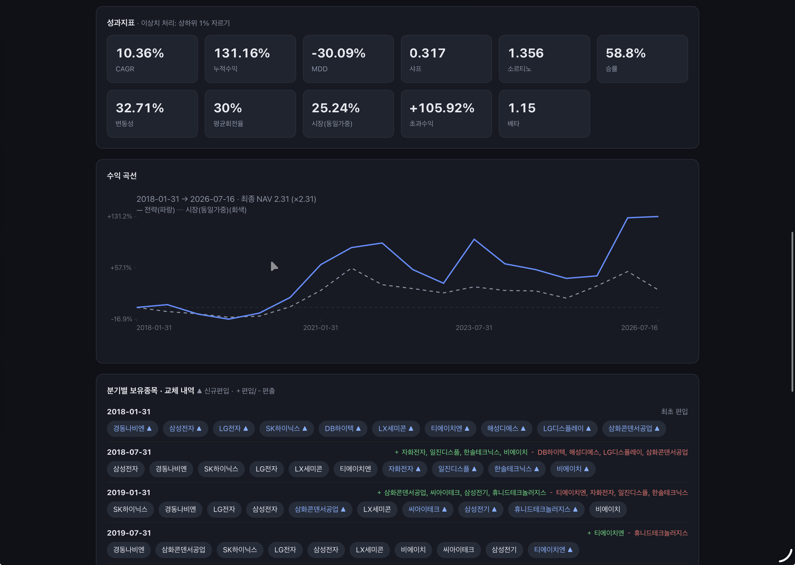
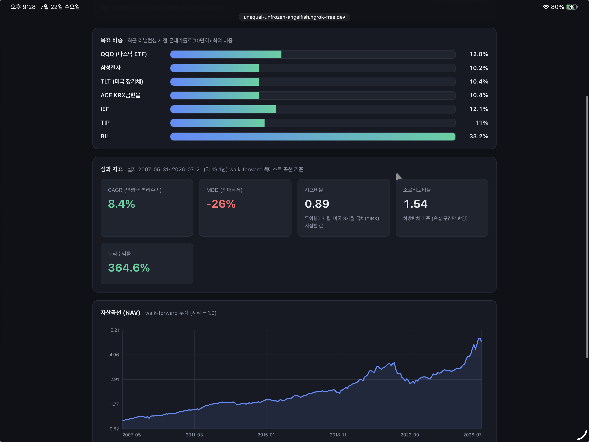

# Quant Assistant

**한국 주식 재무·주가·매크로 데이터를 SQLite에 적재하고, 계층형 멀티에이전트가 자연어 질문에 결정론적 검증까지 거쳐 답하는 개인용 퀀트 리서치 도구.**

[](https://www.python.org/)
[](https://fastapi.tiangolo.com/)
[](https://www.langchain.com/langgraph)
[](https://www.sqlite.org/)
[](https://openai.com/)
[](https://ollama.com/library/exaone3.5)
[](https://ollama.com/library/qwen2.5-coder)

한국 상장사 재무/주가/매크로 데이터를 SQLite에 적재하고, 자연어 질문에 Python가 SQL을 활용해 llm이 답하는
시스템입니다. **두 개의 진입점이 서로 다른 아키텍처로 동작**합니다.



## 아키텍처 한눈에 보기

프롬프트 입력 시, **총괄 에이전트 → (병렬) 활성 도메인 에이전트 3종(한국·매크로·백테스트) → 데이터
에이전트 → 총괄 에이전트의 정합성 검증 → (차트 요청 시) 차트 에이전트** 순서로 흐릅니다. 아래
다이어그램에서 색깔 있는 박스 하나하나가 독립된 에이전트(파일)입니다. 한국주식 에이전트는 질문을 **재무·주가 정보·기술지표** 세
축으로 분류(`classify_intent`)하여, 필요한 하위 데이터 에이전트만 단독으로 또는 여럿을 함께
호출합니다.



> 🛑 하드차단은 규칙 기반이라 항상 같은 결과가 나오고(결정론적), ⚠️ 소프트경고는 LLM이 그때그때
> 판단해 참고용으로만 결과에 첨부됩니다 — 백테스트를 막지는 않습니다. 

---

## 배경과 설계 판단

**Problem** — 한국 주식은 아직 팩터형 초과수익 기회가 상대적으로 오래 남아있는 시장이지만, 개인 투자자가 이를 SQL·파이썬 없이 체계적으로
검증하기는 어렵습니다. 재무제표는 정정공시·관리종목 이력 같은 시점별 함정이 있고, 백테스트는
생존편향·미래참조 같은 실수를 저지르기 쉬운데 일반적인 개인용 도구는 이런 걸 자동으로
걸러주지 않습니다. 

**Analyze** — 총괄 에이전트가 질문을 도메인(한국주식/매크로/백테스트)으로 라우팅하고 결과를
검증·재시도하는 **계층형 멀티에이전트 구조**로 설계했습니다. 백테스트는 LLM이 파이썬 코드를
직접 못 쓰게 하고 사전검증된 26개 Primitive JSON으로 조립하게 해 안전성을 확보하였습니다. 또한,
생존편향·미래참조·공매도는 하드차단하고,
스토리텔링·데이터스누핑처럼 해석의 여지가 있는 문제는 LLM이 판단해 참고용으로만 첨부하도록 하였습니다. 재무 데이터는 "정정 전 값을 지우지 않고 이력으로 남긴
뒤, 조회 시점 기준으로 그때 유효했던 값만 고른다(미래참조 편향 방지)"는 원칙으로 정합성을 확보하기로 했습니다.

**Action** — 계층형 멀티에이전트 시스템을 구축했고 백테스트에는 하드차단 3종 + 소프트경고 4종을 배선했습니다. 재무 데이터는
정정공시 이력·관리종목 이력(KRX+DART 공시)·종목명 변경이력·시가총액 시점별
정확화·가격 이상치 asof-국소화·거래세율 연도별 스케줄까지 6가지 정합성 장치를 넣었습니다.
QVM(퀄리티·밸류·모멘텀) 멀티팩터 전략, 7자산 몬테카를로 올웨더 포트폴리오(21.6년
walk-forward), 매크로 레짐 신호, launchd 기반 8종 자동 데이터 수집까지 부가 기능을
붙였습니다. 
마지막으로, 이 시스템이 내놓는 답이 실제로 맞는지 확인할 방법이 없다는 걸
인지하고, 실제 종목을 동적으로 뽑아 재무제표·실시간주가·차트·스크리닝·백테스트
5개 영역을 실제 시스템에 물어본 뒤 DART 원문·네이버 시세·DB 재계산·
vision 판정과 대조하였습니다.

**Result** — 로컬 LLM(EXAONE·Qwen) vs GPT 정확도·속도를 평가하였습니다. 아래 36개 사실확인 항목 전부(100%)가 시스템 스스로의 주장이 아니라 외부
1차 소스 재조회 또는 DB 직접 재계산과 대조해 통과를 확인한 결과입니다. 이 프로젝트가
실제로 신뢰할 만하게 동작하는지를 보여주는 증거입니다.
- 재무제표 10종목(영업이익 등) — DART 원문 재조회(±1% 오차 허용)
- 실시간 주가 10종목 — 네이버 증권 재조회
- 스크리닝(PER·PBR·ROE 등) 10케이스 — DB 직접 재계산
- 차트 5건(근거 데이터 일치 + 이미지 자체의 시각 품질 vision 판정)
- 백테스트 하드차단 3종(생존편향·미래참조·공매도) + 성과지표 — 기존 pytest 스위트*

(재현 가능한 근거는 `scripts/eval_factcheck.py`에 그대로 남아 있습니다.)


| 항목 | GPT(gpt-5.4-mini) | Qwen2.5-coder:7b | EXAONE3.5:7.8b |
|---|---|---|---|
| 재무제표(10) | 10/10 | 10/10 | 10/10 |
| 실시간 주가(10) | 10/10 | 10/10 | 10/10 |
| 차트(5) | 4/5 | 0/5* | 0/5* |
| 스크리닝(10) | 10/10 | 9/10 | 6/10 |
| 백테스트 pytest(1) | 1/1 | 1/1 | 1/1 |
| **종합(36건)** | **35/36 (97.2%)** | **30/36 (83.3%)** | **27/36 (75.0%)** |
| 평균응답시간(35건) | 10.4s | 74.2s | 152.5s |

\*차트는 판정이 틀린 게 아니라 이미지 자체를 생성하지 못해 측정불가 처리된 것입니다 — 로컬
모델은 자유 코드 차트 생성 경로에서 실패하는 경우가 많았습니다.

- **재무제표·주가는 세 모델 모두 완벽** — DB에서 값을 그대로 읽어오는 결정론적 경로라 모델
  성능과 무관합니다.
- **차트는 로컬 모델 둘 다 실패**했고, GPT만 정상 동작했습니다.
- **스크리닝 정확도**는 GPT 100% > Qwen 90% > EXAONE 60% 순이었고, EXAONE은 존재하지 않는
  종목코드를 만들어내는 할루시네이션이 반복 관찰됐습니다.
- **응답 속도**는 GPT가 압도적으로 빨랐고, 로컬 모델 중에서는 Qwen이 EXAONE보다 뚜렷하게 빨랐습니다.

### 스크린샷으로 보기

| | |
|---|---|
|  | **실시간 처리 상황** — 질문 하나가 라우팅 → 도메인 조회 → 정합성 검증 → (백테스트라면) 추가 7개 로직 검증까지, 각 단계가 끝나는 즉시 오른쪽 패널에 표시됩니다. 무엇을 어떤 순서로 확인했는지 그대로 볼 수 있습니다. |
|  | **복합 통계 질문 응답** — "PBR·GPA를 z-score로 표준화하고 상관관계를 구한 뒤, PBR 5분위별 평균 GPA까지 계산해줘" 같은 다단계 통계 질문에도 답합니다. |
|  | **매크로 신호** — 장단기금리차(10Y-2Y) 레짐을 종합신호로, CNN 공포탐욕지수·VIX는 참고 표시로 매일 자동 계산해둔 값을 보여줍니다. |
|  | **백테스트 설정** — 밸류·수익성·안정성·성장·기타 5개 카테고리 19개 팩터를 체크박스로 골라 방향·가중치까지 지정하고, 시장·산업·거래비용(수수료/거래세/슬리피지)까지 세밀하게 설정해 전략을 조립합니다. |
|  | **백테스트 결과** — CAGR·MDD·샤프·소르티노·승률·베타 등 11개 성과지표와 전략 대 코스피 지수(실측) 수익곡선, 그리고 리밸런싱마다 어떤 종목이 편입·편출됐는지 분기별 이력까지 함께 보여줍니다. |
|  | **올웨더 포트폴리오** — QQQ·삼성전자·TLT·ACE KRX금현물·IEF·TIP·BIL 7자산의 목표비중을 매달 몬테카를로로 재계산하고, 2004년부터 약 21.6년치 walk-forward 백테스트 곡선으로 신뢰도를 함께 보여주는 모니터링 전용 화면입니다. |

> 위 6개 파일(`01-query-progress.png`, `02-query-result.png`, `03-macro-signal.png`,
> `04-backtest-settings.png`, `05-backtest-result.png`, `06-allweather.png`)은 이미
> `docs/screenshots/`에 반영돼 있어 표에 그대로 표시됩니다.

---

## 수정사항

- **무한대기 교착상태 버그 발견·수정** — 차트처럼 결과가 큰 경우 응답이 조용히 실패하던 진짜 시스템 버그(child_conn이 결과를 다 만들어놓고도 parent_conn에게 못 넘겨 서로 무한 대기하는 멀티프로세싱 파이프 교착상태)를 사실확인 스크립트 실행 중 발견해 근본 원인을 고쳤고, 재발 방지 회귀 테스트도 추가했습니다.
- **4분기 순이익 57% 오염 버그 수정** — 종목들의 per이 다르게 나와 분석한 결과, 4분기 실적이 분기값이 아니라 연간누적값 그대로 저장되는 ingest 버그를 찾아냈습니다. 전체 3,924종목의 57%(2,235종목)가 영향을 받고 있어서 수정하였습니다.
- **PER 1억 9,700만 배 이상치 버그 수정** — 코스피 전종목 PER 분포 히스토그램이 519/520개 종목이 한쪽에 쏠리는 이상분포를 보여 추적한 결과, 한 회사의 PER이 1억 9,700만 배까지 치솟은 걸 발견했고, DART 원문을 직접 대조해 "비표준 계정과목 사용"이 근본 원인임을 밝혀 상한 가드를 추가했습니다.
- **API 비용 낭비 버그 수정 ($4.8 실측)** — "코스피 전체 종목" 요청이 무제한 매직넘버(top_n=4000)로 해석돼 프롬프트가 77만 자(31.7만 토큰)까지 불어나고, 실제 API 호출로 약 $4.8가 소진되는 것까지 실측 확인한 뒤 상한을 추가해 근본 해결했습니다.
- **gpt-5.5 100% 실패 버그 수정** — OpenAI 추론모델(gpt-5.5)이 temperature=0을 거부해 모든 질의가 100% 실패하는 걸 실제 API 호출로 확인하고, 설정값을 4단계로 순차 완화하는 재시도 로직으로 근본 해결했습니다.
- **다중지표 질문 시 첫 지표만 조회되던 버그 수정** — 프롬프트에 "PER PBR PSR"과 같은 재무지표를 동시에 물으면, 지표를 하나만 반환하도록 설계된 추출 함수 탓에 첫 번째 지표(PER)만 조회되고 나머지는 통째로 누락되는 걸 실서버 재현으로 확인했습니다. 지표 값은 이미 DB에 다 저장돼 있어 조회 자체는 가능했는데 추출 단계가 하나만 뽑고 있었던 게 원인이었습니다. 질문에 등장한 모든 지표를 순서대로 인식하는 로직을 추가해 근본 해결했습니다.

---

## 목차

- [설치와 빠른 시작](#설치와-빠른-시작)
- [기능 둘러보기](#기능-둘러보기)
- [아키텍처 심층](#아키텍처-심층)
- [데이터 정합성과 품질 안전장치](#데이터-정합성과-품질-안전장치)
- [핵심 기능 딥다이브](#핵심-기능-딥다이브)
- [데이터와 API 레퍼런스](#데이터와-api-레퍼런스)
- [운영과 외부 접속](#운영과-외부-접속)

---

## 설치와 빠른 시작

```bash
pip install -r requirements.txt
cp .env.example .env          # 필요 시 키 입력 (없어도 동작)

python scripts/setup_dummy.py                   # 더미 데이터 생성(API 키 없이 체험용)

uvicorn web.app:app --reload                    # 웹(신규 계층형 구조) — http://127.0.0.1:8000
```

---

## 기능 둘러보기

<details>
<summary>펼쳐서 보기 — 누구에게, 페이지별, 기능별, 에이전트별, 노드별</summary>

### 누구에게, 어떤 화면·기능·에이전트로

#### 이 프로젝트는 누구에게 좋은가
- **개인 퀀트 투자자**: 저PER·고ROE 같은 스크리닝, 리밸런싱 백테스트, QVM 멀티팩터 전략을 SQL·파이썬 몰라도 자연어로 직접 검증해보고 싶은 사람.
- **재무 데이터를 자주 찾아보는 사람**: "삼성전자 PER 알려줘"처럼 종목명만 말해서 DART/FnGuide 재무데이터를 바로 확인하고 싶은 사람(어느 시점·어느 소스 값인지 항상 함께 표시됨).
- **매크로·시장 상황을 정기적으로 체크하는 사람**: 환율·금리차·VIX·Fear&Greed 기반 매크로 레짐 신호를 매일 자동 계산해두고 확인만 하고 싶은 사람.
- **특정 자산배분 전략을 자동으로 추적하고 싶은 사람**: 올웨더(7자산 몬테카를로) 같은 전략의 목표 비중을 매달 자동 재계산하고 텔레그램으로 알림받고 싶은 사람.
- ⚠️ **개인용 리서치·학습 도구**입니다 — 투자자문업 등록이 없고, 스크리닝·백테스트 결과는 참고용이지 매수·매도 추천이 아닙니다.

#### 페이지별
| 경로 | 파일 | 무엇을 하는 화면인가 |
|---|---|---|
| `/`, `/chat` | `chat.html` | **기본 화면.** 멀티턴 대화 — 질문 하나로 시작해 후속 질문을 이어갈 수 있음. 왼쪽 대화이력 · 가운데 답변(+CSV·차트) · 오른쪽 실시간 처리상황+근거데이터, 3열 레이아웃. |
| `/query` | `index.html` | 백테스트 설정 패널(한국 시장, 19개 팩터 체크박스, 산업 필터, 거래비용, 이상치 처리) |
| `/macro` | `macro.html` | 매크로 신호 전용 화면 — 환율·금리차·VIX·Fear&Greed 기반 레짐 판정을 그래프로. |
| `/allweather` | `allweather.html` | 올웨더 포트폴리오 모니터링 — 매달 배치가 계산한 목표비중·CAGR·MDD·샤프·NAV곡선을 읽기 전용으로 표시. |

#### 기능별
| 기능 | 무엇인가 |
|---|---|
| 스크리닝 | "PER 낮은 10개" 같은 조건 검색. 조건·개수만 LLM이 뽑고 실제 정렬·계산은 코드가 결정론적으로 수행. |
| 단일종목/비교 조회 | 특정 종목(들)의 재무·주가 지표 조회, 어느 시점·소스 값인지 항상 명시. |
| 백테스트(한국) | 리밸런싱 전략 시뮬레이션(월/분기/반기/연간), 벤치마크는 실제 코스피 지수. 19개 팩터 사용 가능. |
| QVM 멀티팩터 | 퀄리티·밸류·모멘텀 3개 카테고리를 섹터중립 z-score로 합성한 스크리너+백테스트. |
| 멀티턴 대화 | 직전 결과를 이어서 가공하는 후속질문("그중 PBR 낮은 것만") — SQL 재조회 없이 파이썬 가공만. |
| 차트 | 분포도·산점도·막대·자유형(matplotlib) 차트를 질문에 맞춰 자동 생성. |
| CSV 다운로드 | 스크리닝 결과를 요청한 지표 컬럼만 골라 다운로드. |
| 매크로 신호 | 환율·금리차·VIX·Fear&Greed를 매일 배치로 계산해두고 캐시만 조회(런타임 재계산 없음). |
| 파마프렌치 팩터 조회 | Ken French Data Library 팩터(Mkt-RF/SMB/HML/RMW/CMA/RF/모멘텀)를 질문 시 온디맨드 조회(저장 안 함). |
| 올웨더 포트폴리오 | 7자산(QQQ/삼성전자/TLT/ACE KRX금현물/IEF/TIP/BIL) 몬테카를로 비중최적화(종목당 10~45% 상하한) + 21년+ walk-forward 백테스트, 매달 자동 리밸런싱+텔레그램 알림. |

#### 에이전트별 (`src/agents/`, 신규 계층형 구조가 사용)
| 파일 | 역할 |
|---|---|
| `supervisor.py` | 총괄 — 라우팅(`route_question`)→도메인 실행(`dispatch_domains`)→정합성 검증(`verify_answer`)→최대 3회 재시도→종합결론(`answer_with_verification` 하나로 통합). 차트 요청 시 `_build_charts`(결정론적 3케이스) 우선 시도 후 빈 결과면 `chart_agent`로 폴백. |
| `graph.py` | 총괄 함수를 LangGraph `StateGraph` 노드로 감싸 `.stream()`으로 실행 — 자세한 노드 구조는 아래 "노드별" 참고. |
| `domain_kr.py` | 한국 종목 — 단일/비교/스크리닝 3갈래 분기. 단일·비교 경로에서는 다시 질문을 재무·순수 시세·기술지표로 분류(`classify_intent`)해 필요한 축만(또는 여럿) 호출. "SK하이닉스"뿐 아니라 "하이닉스" 같은 구어체 약칭도 실재 회사면 인식. |
| `domain_macro.py` | 매크로 — 재계산 없이 배치가 미리 적재한 `macro_signal` 최신 1행만 읽음. |
| `domain_backtest.py` | 전략 백테스트·팩터분석 — LLM이 파이썬을 직접 안 쓰고 `{"pipeline":[...]}` JSON 조립 지시서만 생성, 실행은 별도 검증된 엔진이 담당. 종료연도를 질문에 안 밝히면 오늘이 속한 연도를 기본값으로 쓴다. |
| `data_financial.py` | DART/FnGuide 재무 데이터 조회. 어느 소스·어느 분기 값인지 함께 반환. |
| `data_price_kr.py` | 주가·기술지표 조회. |
| `backtest_verification.py` | 백테스트 하드차단 3종(생존편향·미래참조·공매도, 결정론적)+소프트경고 4종(LLM 판정, 참고용 첨부만). |
| `exec_runtime.py` | LLM이 직접 쓴 SQL·파이썬을 안전하게 실행 — SQL은 읽기전용 연결, 파이썬은 별도 자식 프로세스+타임아웃 강제종료. |
| `exec_fallback.py` | 정형 경로 3회 실패 후 딱 한 번 시도하는 자유 코드 최후 폴백(SELECT 1개+파이썬 가공 1개). |
| `conversation.py` | 멀티턴 대화 세션 — 프로세스 메모리 전용, 매 턴 "신규 조회" vs "이어가기" 자동 분기. |
| `chart_agent.py` | matplotlib 자유형 차트 생성(`build_chart_freeform`) — 스크리닝 폴백과 멀티턴 후속질문 양쪽에서 재사용. |
| `charting.py` | 히스토그램·막대·산점도·라인 4종 렌더 헬퍼(참고용 옵션 — `chart_agent`가 원하면 가져다 쓰고, 아니면 matplotlib을 직접 씀). |

#### 노드별 — LangGraph 그래프 구조
현재(신규) 계층형 그래프(`src/agents/graph.py`)는 **의도적으로 노드가 하나**입니다: `START → supervisor → END`. 라우팅·도메인실행·검증·재시도는 전부 이 `supervisor` 노드 **안에서** `answer_with_verification` 함수 호출로 처리됩니다(도메인마다 그래프 노드를 쪼개지 않음 — 스트리밍 이벤트가 노드 완료 시점마다 나오면 충분했기 때문). `.stream()`으로 실행해 노드가 끝날 때마다 `{"step": "supervisor", "summary": "..."}` 진행 이벤트를 방출하고, `run_streaming`이 이걸 별도 스레드+큐로 실시간화해 SSE로 흘려보냅니다.

예전엔 6노드짜리 legacy 파이프라인(`refine → wiki_check → router → sql_gen → wiki_save →
execute`, `cli.py`만 사용, 웹은 호출 안 함)이 별도로 남아 있었으나, 쓰임이 없어져
`cli.py`와 함께 완전히 삭제했습니다 — 지금은 위 계층형 그래프 하나만 있습니다.

### 최근 추가 기능 (히스토그램 · CSV 컬럼 필터링 · QVM 멀티팩터 전략)

#### 히스토그램(분포) 차트
"코스피 PBR 분포 히스토그램 그려줘" 같은 질문에 답합니다. 계산은
`primitives.py::histogram_buckets`(구간 경계·구간별 개수 계산)가 하고, 그림은
`charting.py::render_histogram_chart_base64`가 그립니다. 두 경로에서 각각 다르게 연결됩니다:
- **단발 질의(`/query`)**: `domain_backtest.py`가 만든 파이프라인 JSON에
  `histogram_buckets`가 포함되면, `supervisor.py`가 그 결과 모양을 인식해(`_is_histogram_shape`)
  자동으로 이미지를 붙입니다.
- **멀티턴 대화(`/chat`)**: LLM이 짜는 파이썬 코드 안에서 `charting.py`의 렌더 함수를
  직접 import해 호출하고, 결과 base64 문자열을 `chart_base64`라는 변수에 담습니다. 이
  값을 실행기가 회수할 수 있도록 `exec_runtime.execute_python`에 `extra_vars` 옵션을
  새로 추가했습니다(기존 호출부는 전혀 영향 없음 — 순수 추가).

"PBR 히스토그램"처럼 "백테스트"라는 단어가 전혀 없는 질문이 엉뚱한 도메인(개별 종목 조회)
으로 새지 않도록, `supervisor.py`의 라우팅 키워드에도 "히스토그램/분포도"를 추가했습니다.

#### 스크리닝 결과 CSV — 요청한 컬럼만 내려받기
"PER 낮은 10개 종목"을 CSV로 받으면, 화면에는 여러 참고 필드가 함께 보여도 **CSV에는
종목코드·종목명 + 실제 요청한 지표(PER)만** 남습니다. 스크리닝 결과가 이미 들고 있던
`criteria`(요청 조건 목록)/`top_n` 메타데이터를 재사용해 컬럼을 걸러내며, 화면에 보이는
원본 데이터(근거 데이터 패널)는 그대로 두고 **CSV로 내려받는 시점에만** 좁힙니다. 단발
질의는 `index.html`의 `_screeningCsvColumns`가, 멀티턴 대화는 `conversation.py`의
`_screening_csv_columns`가 같은 규칙으로 동작합니다. 스크리닝이 아닌 결과(단일 종목 조회,
백테스트 결과 등 `criteria`가 없는 경우)는 지금까지처럼 전체 컬럼이 그대로 내려갑니다.

#### QVM(퀄리티·밸류·모멘텀) 멀티팩터 스크리너 + 백테스트
"퀄리티 밸류 모멘텀 전략 상위 20개 뽑아줘" 또는 "QVM 전략으로 2024~2026년 분기 리밸런싱
백테스트 해줘" 같은 질문에 답합니다. 별도 화면이나 API가 아니라, 기존 백테스트 도메인의
파이프라인 JSON 조립 방식 그대로 동작합니다 — LLM이 `get_cross_section_qvm` →
`compute_qvm_scores` → `combine`(또는 `run_qvm_backtest`) 순서의 JSON을 조립하면 실행됩니다.

계산 순서(`primitives.py::compute_qvm_scores`, 사용자가 지정한 순서를 그대로 구현):
1. **가치지표 역수 변환**: PER→E/P, PBR→B/P, PSR→S/P (낮을수록 좋은 지표를 높을수록
   좋은 방향으로 통일)
2. **윈저라이즈**: 각 원지표를 1%/99% 분위수 밖은 경계값으로 눌러 극단치 영향을 줄임
   (기존 IQR 방식 `winsorize()`는 건드리지 않고 `winsorize_pct()`를 별도로 추가)
3. **섹터중립 z-score**: 같은 업종끼리만 비교해 표준화(업종 표본이 5개 미만이면 전체
   유니버스 기준으로 자동 대체)
4. **카테고리 합성**: 퀄리티(ROE·GP/A·CFO비율)/밸류(E/P·B/P·S/P)/모멘텀(12-1개월) 3개
   카테고리 각각 내부 팩터를 등가중 평균
5. **결측 필터**: 원지표 7개 중 3개 이상 결측인 종목은 제외
6. **2차 표준화**: 3개 카테고리 합성점수를 유니버스 전체로 다시 z-score
7. **최종 점수** = (퀄리티_z + 밸류_z + 모멘텀_z) / 3

모멘텀(12-1, 최근 12개월 수익률에서 최근 1개월을 제외한 값)은 전종목을 한 번에 조회해도
느려지지 않도록 **배치 SQL**(`data_access.py::momentum_12_1_batch`)로 계산합니다 — 종목이
5개든 3924개든 SQL 호출 횟수는 항상 2회로 고정되어 있어(종목 수만큼 반복 조회하지 않음),
전종목 스크리닝이 느려지는 기존 성능 문제를 키우지 않습니다. 백테스트는 이미 안전성이
검증된 백테스트 엔진(`engine.py`/`selection.py`/`performance.py`)을 전혀 수정하지 않고,
매 리밸런싱 시점의 지표 계산 함수만 감싸 QVM 점수를 미리 얹어 넘기는 방식(`run_qvm_backtest`)
으로 재사용합니다.

</details>

---

## 아키텍처 심층

<details>
<summary>펼쳐서 보기 — 계층형 멀티에이전트 구조, SQL/Python 실행, 검증 배선, 디렉토리 구조</summary>

### 웹: 계층형 멀티에이전트 아키텍처

(전체 아키텍처 다이어그램은 최상단 "아키텍처 한눈에 보기" 절 참고)

전체 그래프는 `src/agents/graph.py`(`run_hierarchical`/`run_streaming`)가 LangGraph
`StateGraph`로 감싸고, `.stream()`으로 실행해 단계 완료마다 진행 이벤트를 방출합니다
(`GET /api/query/stream`, SSE). 프론트(`web/static/index.html`)는 이 이벤트를 실시간
들여쓰기 트리로 표시합니다.

#### 재무 데이터 소스 구분 (DART vs FnGuide)
- `data_financial.py`가 지표별 매핑표로 먼저 판단하고, 없으면 LLM이 판단합니다.
- DART(`financials` 테이블)와 FnGuide(`fnguide_metrics` 테이블, 컨센서스 목표주가 등
  FnGuide 전용 지표 포함)에 같은 지표가 있고 값이 다르면 **DART 우선**입니다.
- 응답에는 어느 소스를 썼는지(DART|FnGuide) + 어느 분기/시점 값인지 항상 함께 담깁니다.
- 질문에 기간을 명시하지 않으면(예: "삼성전자 PER") 응답에 `data_asof`(어느 종가일·
  어느 분기 값을 자동으로 골랐는지)를 항상 함께 표시합니다 — "지금 물으면 정확히 언제
  시점 데이터가 나오는가"를 답변만 보고도 검증할 수 있게 합니다.

#### 과거 시점(분기·연도) 재무지표 조회
`metrics` 테이블은 **최신 한 분기 스냅샷만** 유지합니다(아래 "데이터" 절 참고) — "24년
영업이익률과 25년 영업이익률"처럼 과거 분기를 지목한 질문은 이 캐시에 그 분기 값이 없을
수 있습니다. 이 경우 캐시 조회가 비어 있을 때만, 백테스트가 이미 쓰는 검증된 계산 경로
(`src/backtest/data_access.py::metrics_at`, 원본 `financials`+`prices`에서 PER/PBR/PSR/
ROE/ROA/ROC/마진/성장률 등 전체 지표를 그 시점 기준으로 즉석 계산)를 재사용해 값을 채웁니다.
새 계산 로직을 추가한 게 아니라 **캐시 우선, 없으면 원본 데이터로 즉석 계산**하는 폴백
순서이므로, 이미 캐시에 있는 값(대개 최신 분기)은 절대 덮어쓰지 않습니다.

#### 백테스트 검증 배선 (`src/agents/backtest_verification.py`)
- **하드차단**(결정론적, LLM 불필요): 생존편향(`check_survivorship`) · 미래참조
  (`check_lookahead`) · 공매도(`check_short_positions`) — 걸리면 실행 자체를 거부합니다.
  검사기 자체에서 예외가 나도 **fail-closed**(안전하게 차단)입니다 — 판정 로직이 죽었다고
  통과시키지 않고, 예외 자체를 "차단" 사유로 취급합니다.
- **소프트경고**(LLM 판정, 결과엔 첨부만): 스토리텔링 · 데이터스누핑 · 신호감소/회전율 · 이상치.
- 계산 엔진 자체(`src/backtest/pipeline_exec.py`)는 재발명하지 않고 그대로 재사용합니다 —
  LLM은 파이썬 코드를 직접 생성하지 않고, 사전검증된 프리미티브를 어떤 순서로 조립할지
  JSON으로만 지시합니다(같은 머신에 실거래봇이 상주하므로 임의 코드 실행을 차단).

#### 왜 백테스트 감시 계층이 필요한가 — 고정 알고리즘, 변동 데이터

**핵심 질문**: "우리는 항상 정해진 방식(고정된 알고리즘)만 쓰는데, 왜 매번 검증을 해야 하나?"

**답**: 방법론(계산 로직)은 고정이지만 **매번 입력되는 데이터(종목·기간·시장 조합)는 다르기 때문**입니다. 코드가 정확하다고 해서 이번 실행의 결과가 자동으로 올바른 건 아닙니다 — "**이번 데이터**가 규칙을 어기지 않았나"를 매 실행마다 확인해야 합니다.

비유하면, 계산기의 더하기 알고리즘은 항상 같지만, 다른 숫자를 입력하면 다른 결과가 나옵니다. 계산기 자체가 깨지지 않았어도, 이번 입력값에 실수가 없었는지는 따로 확인해야 합니다.

**구체적 사례**: 한국 시장도 원래 관리종목·거래정지의 **과거 이력**이 없어(KRX가 '오늘 현재' 스냅샷만 제공), 백테스트 시점에 그 종목이 관리종목이었는지를 소급 검증할 방법이 없었습니다. 코드(계산 로직)는 정상 동작했지만 **데이터가 없어서 특정 시점 검증이 원천적으로 불가능했습니다** — 감사 계층이 없었다면 이 구멍을 발견하지 못했을 것입니다. 이번에 DART 공시 기반 `kr_admin_status_history`로 과거 이력을 소급 복원해 보완했습니다(아래 [데이터 정합성](#데이터-정합성--한국-시장-데이터를-어떻게-정확하게-만들었나) 절 참고).

##### 7대 죄악 — 각 검사가 막는 구체적 실패 시나리오

| 검사 | 차단 방식 | 무엇을 막는가 |
|---|---|---|
| ① 생존편향 | 하드차단 | 망한 회사가 유니버스에서 누락되고, 생존한 회사들의 우수 성과만 남는 착시(선별 편향) |
| ② 미래참조 | 하드차단 | 아직 공시되지 않은 미래 재무를 거래 시점에 이미 알고 있었다는 뜻 → 현실에선 재현 불가능 |
| ③ 공매도비용 | 하드차단 | 엔진이 표현할 수 없는 음수 비중(공매도) 발생 → 실제 주문 실행 자체가 불가능 |
| ④ 스토리텔링 | 소프트경고 | 특정 시기 우연한 성공을 일반적인 투자 원칙처럼 포장(표본 기간이 짧고, 성과 분산이 높음) |
| ⑤ 데이터스누핑 | 소프트경고 | 20개 후보 전부를 테스트하고, 가장 잘 맞은 것 하나만 "검증된 전략"이라고 주장 |
| ⑥ 신호감소·회전율 | 소프트경고 | 매월 회전율이 높아서 거래비용·세금·슬리피지로 순수익이 거의 0에 수렴했음에도 그럴듯한 성과를 보임 |
| ⑦ 이상치제어 | 소프트경고 | 극단값(예: 한 회사의 900% 수익률 같은 이벤트)을 가진 소수 종목이 전체 포트폴리오 평균을 왜곡 |

##### 하드차단 vs 소프트경고 — 신뢰도에 따른 처리

이 구분은 **판정의 신뢰도**를 기준으로 합니다:

- **하드차단 3종** (결정론적, 100% 확실): 코드로 명확히 판별 가능한 위반 → 자동 차단, 사유와 증거 명시. **소프트웨어의 "컴파일 에러"**에 해당합니다.
  - `check_survivorship`: 죽은 종목이 보유에 포함되어 있는가? (DB 조회로 100% 확정)
  - `check_lookahead`: 공시 전 재무가 거래에 사용되었는가? (disclosed_date 비교로 100% 확정)
  - `check_short_positions`: 음수 비중(공매도)이 포함되어 있는가? (숫자 비교로 100% 확정)

- **소프트경고 4종** (LLM 판정, 맥락에 따라 판단): 해석의 여지가 있는 잠재적 문제 → 결과는 유지하되 경고만 첨부. **소프트웨어의 "린트 경고"**에 해당합니다. 사용자가 충분히 고민한 뒤 진행 가능합니다.
  - `inspect_storytelling`: 백테스트 기간이 충분히 길고, 상승/하락/횡보 다양한 국면을 포함하는가?
  - `inspect_snooping`: 사용자 질문이 실제로 사전 등록된 투자 가설인가, 아니면 사후 정당화인가?
  - `inspect_signal_decay`: 회전율 과다로 거래비용이 수익의 대부분을 차지하지 않는가?
  - `inspect_outlier`: 이상치 제거(winsorize/remove_outliers)와 정규화(zscore/rank_sum)가 충분히 되었는가?

#### 에이전트·도메인별 역할 (누가 무엇을 하는가)

| 계층 | 파일 | 하는 일 |
|---|---|---|
| 총괄 | `supervisor.py` | `route_question`(질문을 보고 kr/macro/backtest 중 몇 개 도메인이 필요한지 결정 — LLM 우선, 실패 시 키워드 휴리스틱) → `dispatch_domains`(해당 도메인들을 호출해 원본 결과를 **가공 없이** 보존) → `verify_answer`(도메인 결과가 원래 질문에 실제로 답이 되는지 규칙+LLM으로 재확인) → 불일치면 실패 사유를 피드백해 **최대 3회**까지만 재도전 → `synthesize_conclusion`(종합 결론 문장 생성). 3회를 넘겨도 실패하면 그제서야 아래 exec_fallback을 정확히 1회 시도합니다. |
| 도메인 | `domain_kr.py` | 국내 종목. 질문을 단일종목/다중종목(비교질문)/스크리닝(조건검색) 3갈래로 나눕니다. 단일·다중종목 경로에서는 다시 `classify_intent`가 질문을 **재무·순수 시세·기술지표** 세 축으로 분류해(LLM 우선, 실패 시 키워드 폴백; 여러 축이면 여러 하위 에이전트를 함께 호출) 필요한 데이터만 조회합니다 — 재무는 `data_financial.py`, 순수 시세는 `data_price_kr.py`, 기술지표(이동평균/RSI/MACD/볼린저)는 `data_price_kr.py`가 `compute_technical_indicator`(TA-Lib, `src/backtest/primitives.py`)로 계산해 시세에 부착합니다. 스크리닝은 LLM이 "PER 낮은 순 10개"처럼 **조건(criteria)·개수(top_n)만 JSON으로 뽑고**, 실제 정렬·계산은 `get_cross_section`+`combine`이 결정론적으로 수행합니다(LLM이 숫자를 직접 계산하지 않음 — 계산은 항상 코드가, 판단만 LLM이). 종목명 인식은 "SK하이닉스"처럼 공식명 전체 언급뿐 아니라 "하이닉스"같이 그룹·지주 접두어(SK/LG/삼성 등)를 생략한 구어체도, company 테이블에 실재하는 회사일 때만 후보로 인정하는 방식으로 지원합니다. |
| 도메인 | `domain_macro.py` | **재계산을 하지 않습니다** — launchd로 매일 미리 계산·적재된 `macro_signal` 테이블의 최신 1행을 읽어오기만 합니다(질문이 들어올 때마다 신호를 다시 판정하면 매번 값이 흔들릴 수 있어, "판단은 배치로 1회, 조회는 캐시만"이라는 이 프로젝트 공통 원칙을 여기서도 씁니다). |
| 도메인 | `domain_backtest.py` | 전략 백테스트·팩터분석(상관관계/분위수/히스토그램/QVM 등)을 담당합니다. LLM이 파이썬을 쓰지 않고 `{"pipeline":[{"op":..., "params":..., "out":...}]}` 형태의 **JSON 조립 지시서**만 생성하면(`generate_backtest_steps`), 그 JSON을 먼저 정적 검증(`validate_pipeline_steps` — 존재하지 않는 연산·파라미터 거부)한 뒤 `pipeline_exec.run_pipeline`이 실제 계산을 수행합니다. |
| 데이터 | `data_price_kr.py` / `data_financial.py` | 최하위 계층. 도메인 에이전트가 필요로 하는 주가/재무 데이터를 실제로 조회해줍니다. DB에 직접 `conn.execute()`를 쓰지 않고 **반드시 `exec_runtime.execute_sql`을 경유**합니다 — 이렇게 하나의 통로로 강제해야 아래 "SQL/Python 실행" 절의 안전장치(읽기전용 연결, 스키마 사전검증, 타임아웃)를 모든 SQL 호출이 빠짐없이 통과합니다. `data_financial.py`의 `resolve_metric`은 DART/FnGuide 두 소스 중 어느 쪽 값인지, 어느 분기 값인지까지 함께 반환합니다. |

#### SQL/Python은 실제로 어떻게 실행되는가

이 프로젝트는 "LLM이 만든 코드를 실행"하는 경로가 성격이 다른 **두 종류**로 나뉩니다. 왜
나뉘어 있는지: 같은 macOS 머신에 실거래 자동매매 봇(`quant_trader`)이 함께 떠 있기 때문에,
LLM이 만든 신뢰할 수 없는 코드가 그 프로세스나 데이터베이스에 영향을 줄 수 없도록 두 경로
모두 각자의 방식으로 "울타리"를 쳐 두었습니다.

1. **백테스트 파이프라인(`src/backtest/pipeline_exec.py`)** — LLM은 파이썬 코드를 아예
   작성하지 않습니다. 대신 "어떤 연산을 어떤 파라미터로, 어떤 순서로 실행할지"를 JSON으로만
   지시하고, 실행기가 그 연산 이름을 **고정된 딕셔너리(`PRIMITIVE_OPS`, 현재 26개 연산)**에서
   찾아 실행합니다. `getattr()` 같은 "이름 문자열로 아무 함수나 찾아 호출하는" 방식은 코드
   전체에서 금지되어 있습니다 — LLM이 딕셔너리에 없는 이름을 지어내면 그냥 실행 자체가
   거부됩니다. 안전 상한도 하드코딩되어 있습니다: 파이프라인 단계 최대 20개, 한 번에 다루는
   행 수 최대 4000개, 실행시간 최대 120초(호출자가 이보다 큰 값을 요청해도 무시됩니다).
2. **자유 코드 실행기(`src/agents/exec_runtime.py`)** — 정형 경로로 답할 수 없는 질문을 위해
   LLM이 SQL과 파이썬 코드를 **직접** 작성하는 경로(아래 "자유 코드 최후 폴백"과 멀티턴 대화의
   "이어가기"가 이 경로를 씁니다)입니다. 대신 두 겹의 격리를 둡니다:
   - `execute_sql`: LLM이 쓴 SQL은 **읽기전용 연결**(`connect_readonly`, sqlite의 `mode=ro`)에서만
     실행됩니다 — SELECT가 아닌 문장이 섞여 들어와도 DB 엔진 자체가 "읽기전용 DB에 쓰기
     시도"라는 에러로 거부합니다. 실행 전에 `EXPLAIN`으로 먼저 스키마를 검증해(존재하지 않는
     테이블/컬럼이면 실제 데이터를 읽기 전에 즉시 에러), 무거운 풀스캔이 시작되기 전에
     걸러냅니다. 120초가 지나면 진행 중인 쿼리를 `conn.interrupt()`로 실제로 중단시킵니다.
   - `execute_python`: LLM이 쓴 파이썬 코드는 메인 서버 프로세스가 아니라 **완전히 별도의
     자식 프로세스**(spawn 방식)에서 `exec()`로 실행됩니다. 문제가 생겨도 그 자식 프로세스
     안에서만 터지고 메인 서버에는 영향이 없으며, 타임아웃(기본 120초)이 지나면
     `process.kill()`로 실제 강제 종료합니다(스레드와 달리 "방치"되지 않고 확실히 죽습니다).
     CPU 시간 상한(`RLIMIT_CPU`)도 추가로 걸어둡니다(메모리 상한은 macOS 커널이 지원하지
     않아 시도만 하고 실패하면 조용히 넘어갑니다 — 리눅스에서는 정상 동작 예상). 코드가
     결과 외에 `chart_base64` 같은 보조 값을 만들었으면 `extra_vars` 파라미터로 그 값도
     함께 회수할 수 있습니다(히스토그램 등 차트 기능이 이 경로를 씁니다).

#### 자유 코드 최후 폴백 (`src/agents/exec_fallback.py`)

정형 도메인 경로(스크리닝 조건 JSON, 백테스트 파이프라인 JSON 등)가 표현할 수 없는 질문
— 예: "시장별로 나눠서 각각 상위 10개씩" 같은 복합 질문 — 은 검증을 아무리 반복해도
같은 이유로 계속 실패합니다. `answer_with_verification`이 **정확히 3회** 재시도한 뒤에도
실패하면, 그 다음엔 같은 검증을 다시 걸지 않고 딱 한 번 이 폴백을 시도합니다: LLM이 (1)
필요한 원본 데이터를 넉넉히 가져오는 읽기전용 SELECT 하나, (2) 그 데이터를 원하는 모양으로
가공하는 파이썬 코드 하나를 순서대로 작성하고, 둘 다 위 `exec_runtime.py`로 실행합니다.
파이썬 코드가 실패하면 실패 사유를 다음 시도 프롬프트에 알려주는 자가수정 재시도를 최대
2회까지 합니다. "결과가 비어있지 않은가"만 최소한으로 확인하고, 정형 검증 로직을 다시
태우지는 않습니다(다시 태우면 애초에 정형 경로가 실패했던 것과 같은 이유로 또 실패할
뿐이라 무의미합니다).

#### 데이터 품질 안전장치
스크리닝과 백테스트가 공유하는 데이터접근 계층(`src/backtest/data_access.py::metrics_at`)에
안전장치가 걸려 있습니다. **"비싼 판단은 배치로 1회만 하고 런타임은 캐시만 읽는다"** 는
원칙을 따릅니다(전체 스캔을 매 요청마다 재호출하지 않음).

- **가격 이상치 asof-국소 제외**(`src/data_quality.py`): 인접 거래일 종가비가 2배 이상(≥2.0)
  이거나 1/2 이하(≤0.5)로 튀는 불연속(액면분할/병합이 수정주가로 소급 반영되지 않았거나
  원본 파싱이 틀어진 경우 등)이 있는 종목을 걸러 랭킹·백테스트 오염을 막습니다. 단,
  정리매매·감자처럼 **정상적인** 급등락까지 종목을 전 기간 영구 제외하면 생존편향이
  되레 재유입되므로, `detect_price_quality_anomaly_dates`가 이상 발생일 D를 잡고
  `get_price_quality_excluded_codes(asof=…)`가 그 D 주변 윈도우(`PRICE_ANOMALY_WINDOW_*`)에
  asof가 들어갈 때만 **국소적으로** 제외합니다(멀리 떨어진 과거 시점의 정상 데이터는 살려둠).
  결과는 '종목→이상 발생일' 매핑으로 `ingest_meta`에 캐싱하고, 이후엔 캐시만 조회합니다.

#### 재무 지표 스크리닝 필드 (단일 정의처)
스크리닝 LLM 프롬프트에 노출되는 재무·파생 지표 목록은 **딕셔너리 한 곳**
(`src/backtest/data_access.py`의 `METRIC_FIELD_DESCRIPTIONS`, `{지표키: 한글설명}` 형태)에서
파생됩니다. 도메인 에이전트의 유효 필드 목록(`_KR_SCREEN_FIELDS`)과 스크리닝 프롬프트가
이 딕셔너리에서 자동으로 따라오므로, **새 지표를 추가할 때 이 딕셔너리 한 곳(과
`metrics_at()`의 반환 dict)만 고치면** 됩니다 — 예전엔 지표를 추가할 때마다 별도 목록에
손으로 다시 베껴 적는 걸 깜빡해 스크리닝이 새 지표를 못 쓰던 반복 버그가 있었는데, 그
근본 원인을 없앴습니다. `tests/test_screening_field_descriptions.py`가 이 딕셔너리의 키
집합과 `metrics_at()` 실제 출력의 재무 필드가 어긋나면 실패하도록 강제합니다.

최근 비율·성장률 지표에 더해 **절대금액 지표**(`operating_profit`·`revenue`·`net_income`,
해당 분기 값이며 TTM 아님, 원화)를 추가해 "영업이익이 큰 순", "매출
상위" 같은 절대값 스크리닝을 지원합니다.

#### 예전 파이프라인 (제거됨)
계층형 구조로 재설계할 때 예전 6노드 파이프라인(`refine → wiki_check → router → sql_gen
→ wiki_save → execute → eval`)은 삭제하지 않고 `src/legacy/pipeline.py`로 한동안 이관
보관했습니다(웹은 이 경로를 전혀 호출하지 않았음 — 예전엔 계층형 구조가 확신 못 할 때
자동으로 여기로 넘어가는 안전망이 있었으나, 근본 원인을 고치는 쪽으로 방향을 바꿔
제거했습니다). 유일한 호출부였던 `cli.py`의 `query`/`wiki` 명령까지 쓰임이 없어져,
`src/legacy/`와 `cli.py`를 완전히 삭제했습니다. `wiki` 명령이 하던 질의 기록 관리는
웹의 `/api/wiki`가 이미 동일하게 제공하고, 더미 데이터 생성은 `scripts/setup_dummy.py`로
분리했습니다.

### 디렉토리 구조

```
quant-assistant/
├── requirements.txt
├── .env.example
├── src/
│   ├── config.py             # 환경설정
│   ├── db.py                 # 스키마 + 스키마 카탈로그(프롬프트용)
│   ├── version.py            # data_version 유효시점 로직
│   ├── llm.py                # LLM provider 추상화 (ollama/openai)
│   ├── sql_exec.py           # 읽기 전용 SQL 안전 실행
│   ├── agents/                    # 신규 계층형 멀티에이전트 (웹이 사용)
│   │   ├── graph.py               # LangGraph StateGraph 감싸기 (run_hierarchical/run_streaming)
│   │   ├── supervisor.py          # 라우팅 + 정합성검증 + 재시도(answer_with_verification)
│   │   ├── domain_kr.py / domain_macro.py / domain_backtest.py
│   │   ├── data_financial.py      # DART/FnGuide 재무 데이터 에이전트
│   │   ├── data_price_kr.py       # 주가·기술지표 데이터 에이전트
│   │   ├── backtest_verification.py  # 하드차단 3종 + 소프트경고 4종 배선
│   │   ├── exec_runtime.py        # LLM 생성 SQL/파이썬 안전 실행기(읽기전용 conn + 별도 프로세스)
│   │   ├── exec_fallback.py       # 정형 3회 실패 후 최후 1회 자유 코드 폴백
│   │   ├── conversation.py        # 멀티턴 대화 세션(신규/이어가기 분기, 프로세스 메모리)
│   │   └── charting.py            # 라인/산점도/막대/히스토그램 → base64 PNG
│   ├── backtest/              # engine, primitives(26개 프리미티브, QVM 포함), pipeline_exec, auditor, selection 등
│   ├── allweather/            # 올웨더 포트폴리오: data(가격수집)/montecarlo(비중최적화)/
│   │                          # backtest(walk-forward)/store/notify(텔레그램)/pipeline(오케스트레이션)
│   ├── ingest/                # dart, krx, naver_prices, fnguide_metrics, kr_*, macro_* 등
│   ├── factors/fama_french.py # 파마프렌치 팩터 온디맨드 조회
│   ├── wiki/store.py          # 질의 기록 로그
│   └── eval/                  # factcheck(실측 재검증) · db_isolation
├── web/
│   ├── app.py                 # FastAPI (신규 계층형 구조 사용)
│   └── static/                # chat.html(기본), index.html(/query), macro.html, allweather.html
└── scripts/                   # 데이터 수집/백필/launchd 진입점
```

</details>

---

## 데이터 정합성과 품질 안전장치

<details>
<summary>펼쳐서 보기 — 재무제표 정정공시, 관리종목 이력, 시가총액·가격 이상치 가드, 거래세율</summary>

### 데이터 정합성 — 한국 시장 데이터를 어떻게 정확하게 만들었나

백테스트가 믿을 만하려면 "그 시점에 실제로 존재했던 숫자"를 재현해야 합니다(미래정보 참조·생존편향 방지). 이를 위해 한국 시장 데이터에 아래 6가지 정합성 장치를 넣었습니다. 공통 원칙은 **"원본을 지우지 않고 이력으로 남긴 뒤, 조회 시점(asof) 기준으로 그때 유효했던 값만 고른다"** 입니다.

#### 1. 재무제표 정정공시 이력 (`financials_revision`)
- **무엇**: 기업이 실적을 나중에 정정발표해도 원래 공시값을 덮어쓰지 않고, 정정 전/후 버전을 `financials_revision` 테이블(`src/db.py`)에 각각 이력으로 보존합니다(같은 공시 재수집은 `rcept_no` UNIQUE로 멱등, 진짜 정정만 새 행 추가).
- **왜**: 백테스트가 "2023년 3분기에 **실제로 공시돼 있던** 숫자"로 그 시점 판단을 재현해야 하는데, 최종 정정값만 남기면 미래정보(look-ahead)로 과거를 오염시킵니다.
- **어떻게**: 수집은 `src/ingest/dart.py`·`src/ingest/metrics.py`, 조회는 `src/backtest/data_access.py`의 `effective_quarter_at`(및 TTM/YoY 계열)이 `disclosed_date <= asof` 조건으로 "그 시점까지 공시된 것 중 가장 최근" 버전을 고릅니다. 정정이력 도입 전 데이터는 기존 `financials` 테이블로 폴백(UNION)합니다.

#### 2. 관리종목·거래정지 이력 (`kr_trading_status` + `kr_admin_status_history`)
- **무엇**: 두 소스를 병행합니다 — (a) `kr_trading_status`(`src/ingest/kr_trading_status.py`)는 KRX가 주는 '오늘 현재' 스냅샷을 매일 직전 스냅샷과 diff해 지정~해제 구간을 **앞으로** 누적하고, (b) `kr_admin_status_history`(`src/ingest/kr_admin_status_history.py`)는 DART OpenDART 공시목록(과거 조회 지원)으로 **과거 구간을 소급 복원**합니다.
- **왜**: KRX 스냅샷만으로는 관측 이후 미래 구간만 쌓여, 과거 백테스트 시점에 그 종목이 관리종목·거래정지였는지를 알 수 없습니다.
- **어떻게**: `classify_disclosure`가 공시 제목(report_nm)을 분류하고 `build_status_intervals`가 방향이 확실한 공시만 지정~해제 구간으로 만듭니다. 코스피 "매매거래정지및정지해제"처럼 제목만으로 정지/해제 방향을 알 수 없는 결합형·기간변경·모호 공시는 구간으로 만들지 않고 `review`로 분리해 추측성 오분류를 피합니다(DART 공시만으로는 전 종목을 못 덮으므로 실측 커버리지 약 77%, 한계를 있는 그대로 남깁니다). 소스가 완전히 달라(KRX 스냅샷 vs DART 공시) 두 테이블을 별도로 두되, `kr_admin_status_history`(과거 구간 복원분)는 백테스트 look-ahead 경로에 배선했습니다: `data_access._admin_halt_status_at`이 그 시점(asof)에 열린 구간을 조회해, 매매거래정지(halt)는 상장폐지와 동일하게 `metrics_at`/`check_survivorship`에서 완전 하드차단하고, 관리종목(admin)은 매매 자체는 가능하므로 완전 배제 대신 `select_stocks`에서 신규매수만 차단합니다(직전 리밸런싱에 이미 보유 중이었으면 계속 보유/매도는 허용).

#### 3. 종목명·코드 변경이력 (`kr_stock_changes`)
- **무엇/왜/어떻게**: 상장사가 사명·종목코드를 바꾸면 옛 이름으로는 검색이 끊깁니다. `kr_stock_changes`(`src/ingest/kr_stock_changes.py`)가 변경 전↔후를 연결해, 옛 사명으로 물어도 현재 종목으로 이어지게 합니다(pykrx 조회는 DI로 분리해 네트워크 없이 단위 테스트).

#### 4. 시가총액 시점별 정확화 (`_shares_outstanding_at`)
- **무엇**: 과거 시가총액을 계산할 때 '오늘'의 상장주식수가 아니라 **그 시점의 실제 상장주식수**를 씁니다(`src/ingest/metrics.py`의 `_shares_outstanding_at`/`_effective_shares_outstanding`, `disclosed_date <= asof` 기준).
- **왜**: 유상증자·자사주소각·액면분할로 주식수가 바뀐 종목은 오늘 주식수로 과거 시총을 계산하면 틀립니다(PER/PBR 랭킹 오염).
- **어떻게**: 공시일 오름차순 이력에서 asof 유효값을 고르되, 종목 전체 median 대비 `_SHARES_ANOMALY_RATIO` 배 이상 벗어난 값은 단위오류(×1000 원복형 스파이크, 실측 다수 종목)로 보고 무효화하는 **이상치 가드**를 조회(read) 시점에 한 번 더 적용합니다(액면분할 같은 정상 변화는 배수가 작아 살아남습니다 — `prices.market_cap`·스크리닝 랭킹처럼 자기자본 가드가 없는 소비자를 오염에서 보호).

#### 5. 가격 이상치 가드 asof-국소화 (`src/data_quality.py`)
- **무엇/왜/어떻게**: 정리매매·감자 등으로 인한 **정상적인** 급등락까지 종목을 전 기간 영구 제외하면 생존편향이 되레 재유입됩니다. `detect_price_quality_anomaly_dates`가 이상 발생일 D를 잡고 `get_price_quality_excluded_codes(asof=…)`가 그 D 주변 윈도우(`PRICE_ANOMALY_WINDOW_*`)에 asof가 들어갈 때만 국소적으로 제외합니다(멀리 떨어진 과거 정상 시점 데이터는 보존). 위 [데이터 품질 안전장치](#데이터-품질-안전장치) 절의 그 장치입니다.

#### 6. 거래세율 연도별 스케줄 (`references/securities_transaction_tax_rate_history.md`)
- **무엇/왜**: 매도 거래세율은 해가 바뀌며 인하돼 왔고 코스피/코스닥이 서로 다른데, 과거 백테스트 비용을 단일 현재세율로 계산하면 부정확합니다.
- **어떻게**: 과거 실제 세율을 1차 출처로 검증해 `references/securities_transaction_tax_rate_history.md`에 연도별로 문서화했습니다. **아직 백테스트 비용 계산 코드에는 배선하지 않았습니다(예정)** — 현재 백테스트는 단일 `tax_rate` 파라미터를 씁니다.

</details>

---

## 핵심 기능 딥다이브

<details>
<summary>펼쳐서 보기 — 멀티턴 대화(/chat), 올웨더 포트폴리오(/allweather)</summary>

### 멀티턴 대화 (`/chat`)

기본 화면입니다. "삼성전자 PBR 알려줘" 다음에 "그중에서 낮은 순으로 정렬해줘"처럼 대화를
이어갈 수 있습니다. 핵심 모듈은 `src/agents/conversation.py`이고, 기존에 이미 검증된
총괄 에이전트(`answer_with_verification`)를 새로 만들지 않고 그대로 재사용합니다.

#### 세션은 어떻게 유지되는가
- 세션(`ConversationSession`)은 **서버 프로세스의 메모리(딕셔너리)에만** 존재합니다.
  DB에 저장하지 않으므로 **서버를 재시작하면 대화 이력이 사라집니다** — 실수가 아니라
  의도된 설계입니다(대화 자체가 휘발성 스크래치패드라는 전제).
- 브라우저는 발급받은 `session_id`를 저장해두고 새로고침해도 같은 세션으로 이어갑니다.

#### 매 턴마다 "신규 조회"와 "이어가기" 중 무엇을 고르는가
```
세션에 데이터가 없다(첫 턴)
  └─ 신규 조회: answer_with_verification 그대로 실행 (SQL 재조회 + 검증 + 3회 재시도 +
     필요시 exec_fallback까지 자동)

세션에 데이터가 있다
  └─ 가볍게 LLM에게 "이번 질문이 직전 데이터를 이어서 가공하는 질문인가, 완전히 무관한
     새 주제인가"만 판정시킴(CONTINUE/NEW 한 단어 응답)
       ├─ CONTINUE → 이어가기: 직전 결과를 `data`라는 이름의 변수로 실행 컨텍스트에 주입하고
       │   파이썬 코드만 새로 짜서 실행(SQL 재조회 없음, exec_runtime.execute_python 사용)
       └─ NEW      → 신규 조회로 전환(직전 데이터는 버림)

  이어가기가 실행 자체에 실패하면(코드 에러 등) → 분류가 틀렸을 가능성을 감안해
  신규 조회로 한 번 더 자동 재시도합니다(사용자에게 원시 에러를 그대로 보여주지 않기 위함).
```
"이어서 가공"이라는 프롬프트에는 직전 데이터의 **실제 값은 넣지 않고 구조(행 수·컬럼명)만
요약해서** 넣습니다 — 다만 코드가 실제로 실행될 때는 `data` 변수에 원본 전체가 정상적으로
들어갑니다(프롬프트 절약 목적이지 데이터를 숨기는 게 아닙니다). 실패한 턴은 세션의 데이터를
건드리지 않으므로, 다음 질문은 항상 "마지막으로 성공한 데이터"를 기준으로 이어집니다.

#### 화면 구성과 API
3열 레이아웃입니다 — 왼쪽 대화 이력 사이드바(턴 클릭 시 가운데로 불러오기), 가운데
최종 답변(+ 표 형태면 CSV 다운로드, 차트 요청 시 이미지), 오른쪽 실시간 처리상황(SSE) +
그 턴의 근거 데이터(정형 도메인이 실제로 조회한 원본 결과, 자유 코드면 SQL/파이썬 전문)
패널입니다.

| 메서드 | 경로 | 설명 |
|---|---|---|
| POST | `/api/chat` | 턴 하나 실행(동기) |
| GET | `/api/chat/stream` | 위와 동일 로직을 SSE로 실시간 스트리밍 (오른쪽 진행상황 패널용) |
| POST | `/api/chat/reset` | 세션 초기화 — 누적 맥락을 버리고 처음부터 다시 시작 |
| GET | `/api/chat/history` | 세션의 턴별 질문/답변/근거데이터 목록 |
| GET | `/api/chat/csv` | 특정 턴의 결과를 CSV로 재다운로드(표 형태가 아니면 명확한 사유와 함께 실패) |

### 올웨더 포트폴리오 (`/allweather`)

7종목(QQQ/삼성전자/TLT/ACE KRX금현물/IEF/TIP/BIL)에 매달 몬테카를로로 비중을 재계산해 보여주는
**모니터링 전용** 화면입니다(자동매매 없음 — 계산·저장·알림까지만 하고 실제 주문 실행은
이 기능의 범위 밖입니다). 핵심 모듈은 `src/allweather/`이고, `montecarlo.py`(비중 최적화)는
실거래봇 `quant_trader/portfolio/rebalancer.py`의 계산 로직(연율화 ×252/√252, 샤프비율
공식)을 기반으로 하되, 아래 "종목당 비중 상하한" 절에서 설명하는 상하한 하나만 원본과
다릅니다.

#### lookback(10년)과 백테스트 전체 기간(계속 늘어남)은 다른 숫자입니다
화면 하단에 나오는 "실제 YYYY-MM-DD~YYYY-MM-DD (약 N년)"은 **walk-forward 백테스트
곡선 전체가 커버하는 기간**입니다(2004-11-30부터 시작, 매달 배치가 돌 때마다 최신
종가까지 자동으로 늘어남 — 2026-07 기준 약 21.6년). 이건 알고리즘이 **매달 리밸런싱
결정을 내릴 때 참고하는 기간**(`lookback_years=10`, `backtest.py::run_walk_forward`)과는
완전히 다른 숫자입니다 — 둘 다 맞는 숫자이고, 서로 다른 질문에 대한 답일 뿐입니다.

비유하면: "21.6년짜리 시험을 261번(매달) 봤는데, 매번 시험 볼 때마다 최근 10년치
참고서만 펴놓고 풀었다"는 뜻입니다. 2016년 7월에 리밸런싱할 땐 2006년 7월~2016년
7월(10년)만, 2026년 7월에 리밸런싱할 땐 2016년 7월~2026년 7월(10년)만 보고 판단합니다
(look-ahead 없이 그 시점까지의 데이터만 사용). 이렇게 261번의 "10년짜리 판단"이
이어붙어서 전체 그래프가 21.6년이 되는 겁니다.

#### 종목당 비중 상하한 (10%~45%)
2026-07-17 21.7년 실측 데이터로 검증한 결과, 상하한 없는 무제약 샤프비율 극대화가
(lookback=10년 기준) QQQ+삼성전자에 99% 가까이 쏠리는 코너 솔루션으로 수렴함을
확인했습니다(그 10년 동안 TLT가 가격 기준 마이너스 수익률이었기 때문 — 2022년 금리
급등으로 채권값이 폭락한 여파가 아직 안 회복됨). "올웨더(전천후)"라는 취지에 맞지 않아
종목당 최소10%~최대45% 비중 상하한을 추가했습니다(`montecarlo.py::MIN_WEIGHT`/
`MAX_WEIGHT`, Dirichlet 거부샘플링으로 구현). 이 상하한이 quant_trader 원본과의 유일한
실질적 차이입니다.

**탐색해봤지만 채택하지 않은 것들** (근거 없이 "이게 낫다"고 단정하지 않도록 실측 결과를
남겨둡니다):
- lookback을 20년으로 늘리면 MDD·CAGR·Sharpe가 전부 악화됩니다 — 과거를 더 오래
  기억할수록 최근 성과 변화(TLT의 2022년 실시간 폭락)에 반응이 느려지기 때문입니다.
- 리밸런싱 결정 시점의 과거 3년 구간 MDD를 -15% 이내로 직접 제약하는 방식도
  시도했지만, 실현 MDD는 오히려 -42%로 더 나빠졌습니다 — 결정 시점 과거창에서 계산한
  MDD와 실제 보유 중 겪는 MDD는 다른 값이기 때문입니다.
- 근본 원인은 2022년 "주식+장기채 동반폭락"(금리급등 쇼크, 통상적인 주식-채권
  역상관이 깨진 이례적 구간)으로, 이 4종목 조합 자체의 구조적 한계입니다 — lookback
  길이나 비중 상하한 튜닝으로는 피할 수 없습니다.

#### 가격 데이터 확보 (21.7년 이력)
- 삼성전자: 기존 `prices` DB 테이블(2014년~) 대신 yfinance `005930.KS`를 직접
  조회합니다(2000년~, 더 긺).
- ACE KRX금현물(411060.KS): 2021년 말에야 상장돼 그 이전 데이터가 없습니다. `GLD`
  (달러 표시 실물담보 금ETF, 2004-11~)×`USDKRW=X`(원/달러 환율, 2003-12~)로 만든
  합성 원화금가격으로 과거를 채우고, 411060.KS 실데이터가 존재하는 구간(2021-12-15~)은
  항상 진짜 시세로 이어붙입니다(`data.py::build_synthetic_krx_gold_series`) — 최근·
  실보유 구간은 항상 진짜 데이터가 우선입니다.
- 무위험이자율은 미국 3개월 국채(`^IRX`)를 리밸런싱 시점별 과거값으로 조회합니다
  (`risk_free_rate_at`, 미래참조 없음).

#### 배치 파이프라인
매달 1일 08:10(launchd, `scripts/run_macro_indicators.py`의 07:40과 시간 안 겹침)
`scripts/run_all_weather.py`가 `pipeline.py::run_all_weather_pipeline`을 실행해: 7종목
가격 수집 → walk-forward 백테스트(리밸런싱마다 몬테카를로 10만회 재계산, look-ahead
없음) → `all_weather_snapshot` 테이블에 이력 저장(직전 달 대비 비중 델타 계산용) →
quant_trader와 동일한 텔레그램 채널로 알림 발송(직전 달 대비 비중 변화 포함) 순서로
동작합니다. 화면(`/allweather`)은 이 저장된 최신 스냅샷을 **읽기만** 합니다 — 접속
시 즉석 재계산하지 않습니다(매크로 신호와 동일한 "판단은 배치로 1회, 조회는 캐시만"
원칙).

</details>

---

## 데이터와 API 레퍼런스

<details>
<summary>펼쳐서 보기 — 테이블 스키마, 데이터 출처, 자동 갱신, API 목록, 키 발급, 평가</summary>

### 데이터 (SQLite, `data/market.db`)

| 테이블 | 설명 |
|---|---|
| `company` | 종목코드, 회사명, 시장구분(KOSPI/KOSDAQ), 업종(KRX 업종분류가 유일한 최종 출처) |
| `financials` | 종목코드, 기준분기, 공시일, 정규화 계정키, 원본 계정명, 금액 (DART) |
| `fnguide_metrics` | 종목코드, 지표, 시점 — DART에 없는 컨센서스/목표주가 등 (FnGuide) |
| `prices` | 종목코드, 날짜, 종가, 시가총액 (KRX+네이버 병합, 단일 소스) |
| `metrics` | 종목코드, 기준분기, 종가날짜, PER/PBR/ROE/영업이익률/부채비율 등 파생 지표 — **최신 한 분기 스냅샷만 유지**(과거분기 이력 아님). 과거 시점 조회는 "과거 시점(분기·연도) 재무지표 조회" 절 참고 |
| `metric_def` | 지표명, 컬럼명, 방향(높을수록/낮을수록 우수), 카테고리 — 백테스트 UI 자동 생성용 |
| `delisting` | 종목코드, 상장폐지일 — 백테스트 생존편향 제거용(상폐 종목도 유니버스에 유지) |
| `backtest_runs` | 전략명, 파라미터, 기간, 거래비용 설정, 결과지표, 실행시각 |
| `raw_reports` | DART 원본 응답(재파싱용 보관) |
| `macro_indicators` / `macro_signal` | 거시지표 원본값 / 파생 신호 |
| `all_weather_snapshot` | 올웨더 포트폴리오 월별 스냅샷(비중/CAGR/MDD/샤프/누적수익률/백테스트곡선) — 매달 배치가 append |
| `wiki` | 질문·SQL·태그 등 **질의 기록 로그**(과거 유사도 캐시 기능은 폐기, 지금은 하위호환용) |
| `result_cache` | (SQL해시 + data_version) → 결과. legacy 파이프라인 전용이었는데 그 파이프라인이 삭제돼 지금은 아무도 쓰지 않는 이력 테이블(데이터 보존 목적으로만 스키마 유지) |
| `ingest_meta` | 실제 공시된 최신 분기 / 최신 종가일 등 체크포인트 |

#### 데이터는 어디서 가져오는가 (출처 · 수집 방식)

| 출처 | 가져오는 것 | 담기는 테이블 | 수집 방식 |
|---|---|---|---|
| [OpenDART](https://opendart.fss.or.kr) (전자공시시스템 Open API) | 국내 상장사 재무제표 원본(계정과목·금액) | `financials`, `raw_reports`(재파싱용 원본 보관) | API 키 발급 후 `src/ingest/dart.py`가 호출, 일일 조회 한도 안에서 증분 수집 |
| FnGuide (웹페이지) | DART에 없는 컨센서스 전망치·목표주가 등 | `fnguide_metrics` | `src/ingest/fnguide_metrics.py`가 종목별 페이지를 크롤링(값이 다르면 항상 DART 우선) |
| KRX 정보데이터시스템 | 업종분류(29개 표준 카테고리) | `company.sector` | `scripts/backfill_sector_krx.py`(계정 필요, 없으면 pykrx 업종분류 API가 403) |
| pykrx + 네이버 금융 | 국내 종목 종가·시가총액 | `prices` | 두 소스를 병합해 하나의 테이블로 통일(`src/ingest/naver_prices.py` 등) |
| [Ken French Data Library](https://mba.tuck.dartmouth.edu/pages/faculty/ken.french/data_library.html) | 파마프렌치 팩터(Mkt-RF/SMB/HML/RMW/CMA/RF, 모멘텀) | (저장 안 함 — CLI 온디맨드 조회 전용) | `src/factors/fama_french.py`가 `pandas_datareader`로 질문 즉시 조회 |
| FRED(장단기 금리차 T10Y2Y) · CNN Fear & Greed · VIX | 매크로 레짐 판정용 원지표 | `macro_indicators` → 판정 결과는 `macro_signal` | `scripts/run_macro_indicators.py`가 매일 수집 후 신호 재계산 |

`data/market.db` 자체는 이 프로젝트가 직접 만드는 **1차 가공 결과물**입니다 — 위 출처들에서
원본을 받아와 `src/ingest/normalize.py`(계정과목 정규화)·`src/ingest/metrics.py`(파생지표
계산)를 거쳐 하나의 SQLite 파일로 통합해 저장합니다. 어떤 값이든 최종 답변에는 "어느
출처에서, 어느 시점 값인지"가 함께 표시됩니다(DART/FnGuide 구분은 위 "재무 데이터 소스
구분" 절 참고).

**계정과목 정규화**(`src/ingest/normalize.py`): 회사별 비표준 표기를 표준 키로 매핑.
예) `매출액` / `영업수익` / `수익(매출액)` / `매출` → `revenue`

**파생 지표**(`src/ingest/metrics.py`)
- PER = 시가총액 / 당기순이익(TTM, 최근 4분기 합) · PBR = 시가총액 / 지배주주지분
- ROE = 순이익(TTM) / 자기자본 평균 · 영업이익률 = 영업이익(단일분기) / 매출(단일분기) · 부채비율 = 부채 / 자본

### 데이터 자동 갱신 (launchd)

DART 일일 조회 한도 때문에 "매일 전부 다시 받기"가 아니라, **이미 있는 건 건너뛰고
새로 생긴 것만 받는** 증분 방식입니다.

| 작업 | 주기 | 스크립트 |
|---|---|---|
| 신규상장 종목 재무 백필 | 매일 새벽 2시 | `scripts/backfill_full.py` |
| 분기 공시 증분 체크 | 매일 아침 7시30분 | `scripts/update_financials.py` |
| KRX 업종분류 재동기화 | 매월 1일 | `scripts/backfill_sector_krx.py` |
| 국내 주가/시총 | 매일 | `scripts/update_prices.py`, `scripts/run_naver_prices.py` |
| FnGuide 지표 | 매일 | `scripts/run_fnguide_metrics.py` |
| 매크로 지표 | 매일 | `scripts/run_macro_indicators.py` |
| 올웨더 포트폴리오 리밸런싱+텔레그램 알림 | 매달 1일 08:10 | `scripts/run_all_weather.py` |
| 전체 재수집(refeed, 복사본→swap) | 필요 시 | `scripts/run_refeed_cron.sh` |

### 웹 (FastAPI)

```bash
uvicorn web.app:app --reload      # http://127.0.0.1:8000
```

| 메서드 | 경로 | 설명 |
|---|---|---|
| POST | `/api/query` | 계층형 총괄 그래프 실행 → 종합결론 + 도메인별 원본결과(단발 질의, `/query` 화면용) |
| GET | `/api/query/stream` | 위와 동일 로직을 SSE로 실시간 스트리밍(진행 트리용) |
| POST | `/api/query/rerun` | 사용자가 고친 조건JSON/파이프라인을 LLM 없이 결정론적으로 재실행(휴먼인더루프) |
| POST | `/api/chat`, `GET /api/chat/stream`, `POST /api/chat/reset`, `GET /api/chat/history`, `GET /api/chat/csv` | 멀티턴 대화(`/chat` 화면용) — 자세한 동작은 [핵심 기능 딥다이브](#핵심-기능-딥다이브) 절 참고 |
| GET | `/api/models` | 선택 가능한 LLM 목록 + 가용성 |
| GET/PUT/DELETE | `/api/wiki`, `/api/wiki/{id}` | 질의 기록 로그(하위호환 유지, 신규 질의는 자동 저장 안 함) |
| GET | `/api/stats` | 기록 통계 |
| GET | `/api/macro`, `/api/macro/signal`, `/api/macro/history` | 거시지표(환율/지수/파마프렌치) + 파생 신호 |
| GET | `/api/metric-defs`, `/api/sectors` | 백테스트 UI용 지표 정의 / 업종 목록 |
| POST | `/api/backtest` | 백테스트 실행 |
| GET | `/api/backtest-runs` | 저장된 백테스트 이력 |
| GET | `/api/allweather` | 올웨더 포트폴리오 최신 스냅샷 조회(저장된 값 읽기만, 즉석 재계산 없음) |
| GET | `/`, `/chat` | **기본 화면** — 멀티턴 대화(`chat.html`) |
| GET | `/query` | 예전 단발 질의 화면(`index.html`, 실시간 트리 + 백테스트 UI 패널) |
| GET | `/macro` | 매크로 전용 화면 |
| GET | `/allweather` | 올웨더 포트폴리오 모니터링 화면(`allweather.html`) |

프론트(`/query`): 질의 입력 + 실시간 트리(`🌳`) + 종합결론/도메인별 원본 데이터 + 백테스트
패널(접이식, 산업 필터·조합방식·거래비용 등).

### 실제 데이터 수집 (키 발급 후)

1. **OpenDART** — https://opendart.fss.or.kr 에서 키 발급 → `.env`의 `DART_API_KEY`
2. **KRX 정보데이터시스템** — https://data.krx.co.kr 계정 → `.env`의 `KRX_ID`/`KRX_PW`
   (업종분류 조회용, 없으면 pykrx 업종분류 API가 403으로 실패)
3. 최초 1회 전체 백필 후에는 launchd 작업이 증분으로 이어받습니다(위 표 참고).

### 파마프렌치 팩터 온디맨드 조회

`.omc/specs/brainstorming-fama-french-factor-lookup.md` 참고. 매크로 에이전트
(`domain_macro.py`)가 질문을 파마프렌치 팩터(Mkt-RF/SMB/HML/RMW/CMA/RF, Momentum)
질문으로 감지하면(`classify_factor_intent`) `macro_signal` 테이블을 거치지 않고
[Ken French Data Library](https://mba.tuck.dartmouth.edu/pages/faculty/ken.french/data_library.html)를
`pandas_datareader`로 즉시 조회해 답합니다. **저장·캐시 없음, 웹 요청 하나로 바로 응답**
(원래 `src/factors/fama_french.py`의 `handle_query()`는 CLI용 y/n 확인을 전제로 설계됐으나,
웹 요청-응답 흐름엔 안 맞아 매크로 에이전트는 확인 없이 바로 조회하도록 재구성했습니다).

### LLM 설정 (`.env`)

```ini
LLM_PROVIDER=openai            # "openai" | "ollama"

# OpenAI
OPENAI_API_KEY=sk-...
OPENAI_MODEL_SQL=gpt-5.4-mini  # SQL/코드 생성 (권장)
OPENAI_MODEL_JUDGE=gpt-5.5     # Judge/검증 (권장)

# Ollama (로컬)
OLLAMA_HOST=http://localhost:11434
OLLAMA_MODEL=qwen2.5-coder:7b-instruct-q4_K_M
```

- 키/데몬이 없으면 각 에이전트는 **결정론적 휴리스틱 폴백**으로 동작합니다.

### 평가 (`src/eval/`)

미리 써둔 정답셋과 대조하던 legacy 3층 평가(`evaluator.py`/`goldset.py`/`runner.py`,
`cli.py eval`)는 제거했습니다 — 지금은 **factcheck(실측 재검증)** 방식이 실제 평가
수단입니다.

- **factcheck** (`src/eval/factcheck/`, `scripts/eval_factcheck.py`): 무작위로 뽑은
  실제 종목·질문에 대해 시스템(`run_hierarchical`) 답을 낸 뒤, DART 원문·네이버 실시간
  시세·DB 재계산·vision 판정 등 **그때그때 다시 조회한 값**과 대조합니다. 재무제표/
  실시간 주가/차트/스크리닝/백테스트 5개 도메인을 커버합니다. 평가는 항상 원본 DB의
  격리 사본(`db_isolation.py`)에서 실행됩니다(원본 보호).

</details>

---

## 운영과 외부 접속

<details>
<summary>펼쳐서 보기 — ngrok을 통한 외부 접속</summary>

### 외부 접속 (ngrok)

집 밖이나 다른 컴퓨터에서 접속하려면 ngrok 터널을 사용합니다. **basic-auth로 보호**됩니다.

```bash
./start_server.sh   # FastAPI(8000) 백그라운드 + ngrok 실행 → 외부 접속 URL 출력
./stop_server.sh    # FastAPI + ngrok 동시 종료
```

- 인증 정보는 `.env`의 `NGROK_USERNAME` / `NGROK_PASSWORD`. 외부에서 접속하면 브라우저가 아이디/비밀번호를 먼저 묻습니다.
- **ngrok 미설치 시** `start_server.sh`가 설치 방법을 안내합니다:
  `brew install ngrok/ngrok/ngrok` (또는 https://ngrok.com/download) → `ngrok config add-authtoken <토큰>`
  (토큰: https://dashboard.ngrok.com/get-started/your-authtoken)
- 무료 ngrok은 **실행할 때마다 URL이 바뀝니다.** 현재 URL은 실행 출력 또는 ngrok 대시보드 http://localhost:4040 에서 확인.
- ⚠️ **보안**: OpenAI/DART 키가 든 앱이므로 basic-auth는 필수이고, 비밀번호를 충분히 강하게 두세요. 외부 노출 중에는 질의가 OpenAI 비용을 유발할 수 있으니 사용 후 `./stop_server.sh`로 닫는 것을 권장합니다.

</details>

---

개인 리서치·학습 목적으로 만든 프로젝트입니다. 버그 제보나 피드백은 언제든 환영합니다.
