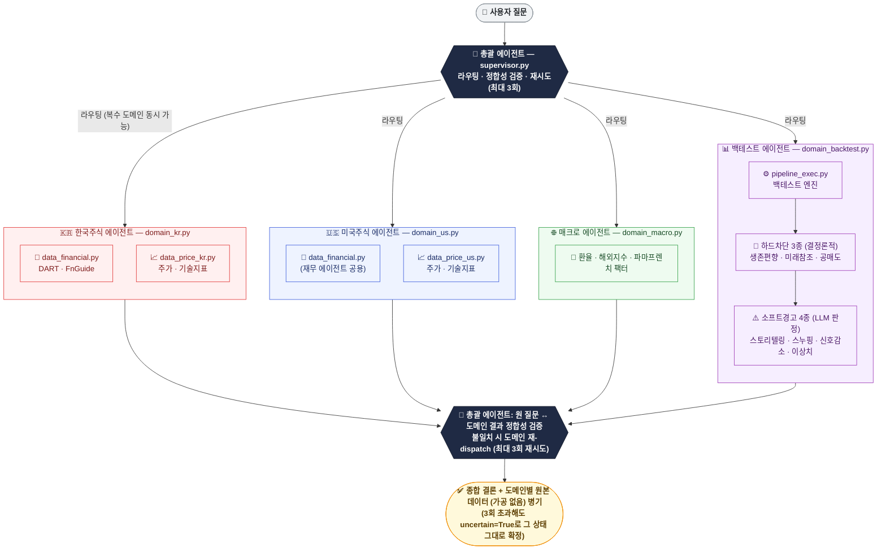

# Quant Assistant

> 저장소: https://github.com/sonjong980304-tech/dart-text2sql-wiki (비공개)

한국·미국 상장사 재무/주가/매크로 데이터를 SQLite에 적재하고, 자연어 질문에 답하는
시스템입니다. **두 개의 진입점이 서로 다른 아키텍처로 동작**합니다.

- **웹(`web/app.py`)**: 신규 **계층형 멀티에이전트** 구조. 총괄 에이전트가 한국주식/
  미국주식/매크로/백테스트 도메인으로 라우팅하고, 도메인 결과를 검증·재시도한 뒤
  종합 결론 + 도메인별 원본 데이터를 함께 반환합니다.
- **CLI(`cli.py query`)**: 예전 **6노드 LangGraph 파이프라인**(`src/legacy/pipeline.py`)을
  그대로 씁니다. 계층형 구조로 아직 이관되지 않았습니다 — CLI로 실행한 결과와 웹으로
  실행한 결과가 다를 수 있습니다.

> 키(OpenDART/OpenAI) 없이도 **더미 데이터 + 휴리스틱 폴백**으로 전체 파이프라인이 동작합니다.
> 실제 수집/LLM 평가는 키 발급 후 동일 코드로 그대로 실행됩니다.

---

## 웹: 계층형 멀티에이전트 아키텍처

질문 하나가 **총괄 에이전트 → (병렬) 도메인 에이전트 4종 → 데이터 에이전트 → 총괄 에이전트의
정합성 검증** 순서로 흐릅니다. 아래 다이어그램에서 색깔 있는 박스 하나하나가 독립된 에이전트
(파일)입니다 — GitHub에서 이 파일을 열면 실제 도형으로 렌더링됩니다.



> 🛑 하드차단은 규칙 기반이라 항상 같은 결과가 나오고(결정론적), ⚠️ 소프트경고는 LLM이 그때그때
> 판단해 참고용으로만 결과에 첨부됩니다 — 백테스트를 막지는 않습니다.

전체 그래프는 `src/agents/graph.py`(`run_hierarchical`/`run_streaming`)가 LangGraph
`StateGraph`로 감싸고, `.stream()`으로 실행해 단계 완료마다 진행 이벤트를 방출합니다
(`GET /api/query/stream`, SSE). 프론트(`web/static/index.html`)는 이 이벤트를 실시간
들여쓰기 트리로 표시합니다.

### 재무 데이터 소스 구분 (DART vs FnGuide)
- `data_financial.py`가 지표별 매핑표로 먼저 판단하고, 없으면 LLM이 판단합니다.
- DART(`financials` 테이블)와 FnGuide(`fnguide_metrics` 테이블, 컨센서스 목표주가 등
  FnGuide 전용 지표 포함)에 같은 지표가 있고 값이 다르면 **DART 우선**입니다.
- 응답에는 어느 소스를 썼는지(DART|FnGuide) + 어느 분기/시점 값인지 항상 함께 담깁니다.

### 백테스트 검증 배선 (`src/agents/backtest_verification.py`)
- **하드차단**(결정론적, LLM 불필요): 생존편향(`check_survivorship`) · 미래참조
  (`check_lookahead`) · 공매도(`check_short_positions`) — 걸리면 실행 자체를 거부합니다.
- **소프트경고**(LLM 판정, 결과엔 첨부만): 스토리텔링 · 데이터스누핑 · 신호감소/회전율 · 이상치.
- 계산 엔진 자체(`src/backtest/pipeline_exec.py`)는 재발명하지 않고 그대로 재사용합니다 —
  LLM은 파이썬 코드를 직접 생성하지 않고, 사전검증된 프리미티브를 어떤 순서로 조립할지
  JSON으로만 지시합니다(같은 머신에 실거래봇이 상주하므로 임의 코드 실행을 차단).

### 데이터 품질 안전장치
스크리닝과 백테스트가 공유하는 데이터접근 계층(`src/backtest/data_access.py::metrics_at`,
`data_access_us.py::metrics_at_us`)에 세 가지 안전장치가 걸려 있습니다. 셋 다 **"판단은
AI/API가 하되, 결과는 캐싱해 매 요청마다 재호출하지 않는다"** 는 같은 원칙을 따릅니다
(비싼 판단을 배치로 1회만 하고 런타임은 캐시만 읽음).

- **가격 이상치 종목 제외**(`src/data_quality.py`): 인접 거래일 종가비가 2배 이상(≥2.0)
  이거나 1/2 이하(≤0.5)인 구간이 이력 어디든 있으면 그 종목을 **통째로** 제외합니다
  (상승·하락 양방향 대칭). 액면분할/병합이 수정주가로 소급 반영되지 않았거나 원본
  파싱이 틀어진 종목을 걸러 랭킹 오염을 막습니다. 전체 스캔(수백만 행)은 비싸므로 결과
  종목코드 집합을 `ingest_meta`에 캐싱하고, 이후엔 캐시만 조회합니다(일일 가격 적재 후
  배치가 `refresh=True`로 갱신).
- **US 증권종류 분류**(`security_type`): 워런트/ADR/우선주/유닛/신주인수권 같은 파생·특수
  증권은 시가총액이 비정상적으로 작아 PER이 비현실적으로 낮게 잡혀 저PER 스크리닝 상위를
  오염시켰습니다. 회사명 전체 문자열의 의미를 **LLM이 배치로 판단**해
  `us_company.security_type`에 캐싱하고(`scripts/backfill_us_security_type.py`), 런타임
  필터(`domain_us.py::_filter_common_stock`)는 이 캐시를 읽어 `common`(일반 보통주)만
  남깁니다. 아직 분류되지 않은(NULL) 종목만 회사명 키워드 안전망으로 최소한만 걸러냅니다.
- **US 재무 보고통화 게이팅**(`financial_currency`): 외국기업 ADR은 주가는 달러로
  거래되지만 실적을 본국통화로 보고하는 경우가 흔합니다(예: SK텔레콤 SKM = KRW). 이때
  시가총액(달러)을 순이익(원화)으로 나누면 통화 불일치로 PER이 비현실적으로 낮게
  계산됩니다. yfinance `financialCurrency`를 **배치로 수집**해
  `us_company.financial_currency`에 캐싱하고(`scripts/backfill_us_financial_currency.py`),
  `metrics_at_us`가 `USD`가 아닌 종목의 재무 파생 필드를 무효화합니다.

### 재무 지표 스크리닝 필드 (단일 정의처)
스크리닝 LLM 프롬프트에 노출되는 재무·파생 지표 목록은 **딕셔너리 한 곳**에서 파생됩니다
— KR은 `src/backtest/data_access.py`의 `METRIC_FIELD_DESCRIPTIONS`, US는
`data_access_us.py`의 `METRIC_FIELD_DESCRIPTIONS_US`(`{지표키: 한글설명}` 형태). 도메인
에이전트의 유효 필드 목록(`_KR_SCREEN_FIELDS`/`_US_SCREEN_FIELDS`)과 스크리닝 프롬프트가
이 딕셔너리에서 자동으로 따라오므로, **새 지표를 추가할 때 이 딕셔너리 한 곳(과
`metrics_at()`의 반환 dict)만 고치면** 됩니다 — 예전엔 지표를 추가할 때마다 별도 목록에
손으로 다시 베껴 적는 걸 깜빡해 스크리닝이 새 지표를 못 쓰던 반복 버그가 있었는데, 그
근본 원인을 없앴습니다. `tests/test_screening_field_descriptions.py`가 이 딕셔너리의 키
집합과 `metrics_at()` 실제 출력의 재무 필드가 어긋나면 실패하도록 강제합니다.

최근 비율·성장률 지표에 더해 **절대금액 지표**(`operating_profit`·`revenue`·`net_income`,
해당 분기 값이며 TTM 아님 — KR은 원화, US는 달러)를 추가해 "영업이익이 큰 순", "매출
상위" 같은 절대값 스크리닝을 지원합니다.

### 예전 파이프라인 (`src/legacy/`)
계층형 구조로 재설계하며 예전 6노드 파이프라인(`refine → wiki_check → router → sql_gen
→ wiki_save → execute → eval`)은 삭제하지 않고 `src/legacy/pipeline.py`로 이관 보관했습니다.
**웹은 이 경로를 전혀 호출하지 않습니다**(예전엔 계층형 구조가 확신 못 할 때 자동으로
여기로 넘어가는 안전망이 있었으나, 근본 원인을 고치는 쪽으로 방향을 바꿔 제거했습니다).
`cli.py`의 `query` 명령은 아직 이 경로에 직접 의존합니다.

---

## 데이터 (SQLite, `data/market.db`)

| 테이블 | 설명 |
|---|---|
| `company` | 종목코드, 회사명, 시장구분(KOSPI/KOSDAQ), 업종(KRX 업종분류가 유일한 최종 출처) |
| `financials` | 종목코드, 기준분기, 공시일, 정규화 계정키, 원본 계정명, 금액 (DART) |
| `fnguide_metrics` | 종목코드, 지표, 시점 — DART에 없는 컨센서스/목표주가 등 (FnGuide) |
| `prices` | 종목코드, 날짜, 종가, 시가총액 (KRX+네이버 병합, 단일 소스) |
| `metrics` | 종목코드, 기준분기, 종가날짜, PER/PBR/ROE/영업이익률/부채비율 등 파생 지표 |
| `metric_def` | 지표명, 컬럼명, 방향(높을수록/낮을수록 우수), 카테고리 — 백테스트 UI 자동 생성용 |
| `delisting` | 종목코드, 상장폐지일 — 백테스트 생존편향 제거용(상폐 종목도 유니버스에 유지) |
| `backtest_runs` | 전략명, 파라미터, 기간, 거래비용 설정, 결과지표, 실행시각 |
| `us_company` / `us_prices` / `us_financials` | 미국 주식 버전(NASDAQ 스크리너 + yfinance) |
| `raw_reports` | DART 원본 응답(재파싱용 보관) |
| `macro_indicators` / `macro_signal` | 거시지표 원본값 / 파생 신호 |
| `wiki` | 질문·SQL·태그 등 **질의 기록 로그**(과거 유사도 캐시 기능은 폐기, 지금은 하위호환용) |
| `result_cache` | (SQL해시 + data_version) → 결과 (legacy 파이프라인 전용) |
| `ingest_meta` | 실제 공시된 최신 분기 / 최신 종가일 등 체크포인트 |

**계정과목 정규화**(`src/ingest/normalize.py`): 회사별 비표준 표기를 표준 키로 매핑.
예) `매출액` / `영업수익` / `수익(매출액)` / `매출` → `revenue`

**파생 지표**(`src/ingest/metrics.py`)
- PER = 시가총액 / 당기순이익(TTM, 최근 4분기 합) · PBR = 시가총액 / 지배주주지분
- ROE = 순이익(TTM) / 자기자본 평균 · 영업이익률 = 영업이익(단일분기) / 매출(단일분기) · 부채비율 = 부채 / 자본

---

## 데이터 자동 갱신 (launchd)

DART 일일 조회 한도 때문에 "매일 전부 다시 받기"가 아니라, **이미 있는 건 건너뛰고
새로 생긴 것만 받는** 증분 방식입니다.

| 작업 | 주기 | 스크립트 |
|---|---|---|
| 신규상장 종목 재무 백필 | 매일 새벽 2시 | `scripts/backfill_full.py` |
| 분기 공시 증분 체크 | 매일 아침 7시30분 | `scripts/update_financials.py` |
| KRX 업종분류 재동기화 | 매월 1일 | `scripts/backfill_sector_krx.py` |
| 국내 주가/시총 | 매일 | `scripts/update_prices.py`, `scripts/run_naver_prices.py` |
| 미국 주가/재무/유니버스 | 매일 | `scripts/run_us_prices.py`, `scripts/run_us_financials.py`, `scripts/run_us_universe.py` |
| FnGuide 지표 | 매일 | `scripts/run_fnguide_metrics.py` |
| 매크로 지표 | 매일 | `scripts/run_macro_indicators.py` |
| 전체 재수집(refeed, 복사본→swap) | 필요 시 | `scripts/run_refeed_cron.sh` |

---

## 설치 & 빠른 시작

```bash
pip install -r requirements.txt
cp .env.example .env          # 필요 시 키 입력 (없어도 동작)

python cli.py setup-dummy                       # 더미 데이터 생성
python cli.py query "PER이 낮은 5개 회사"          # 질의 (legacy 파이프라인)
python cli.py query "반도체 업종 영업이익률 높은 순" --eval   # 질의 + 3층 평가
python cli.py eval                              # 정답셋 평가 (legacy 파이프라인 기준)

uvicorn web.app:app --reload                    # 웹(신규 계층형 구조) — http://127.0.0.1:8000
```

### CLI 명령 (`cli.py`, legacy 파이프라인)
| 명령 | 설명 |
|---|---|
| `setup-dummy` | 더미 데이터 생성 |
| `query "<질문>" [--eval]` | 자연어 질의(결과+SQL+라우팅+캐시상태 [+평가]). 파마프렌치 팩터 질문이면 SQL 대신 Ken French Data Library를 온디맨드 조회 |
| `eval [--limit N] [-v]` | 정답셋 3층 평가 |
| `wiki list [--tag T]` / `show ID` / `verify ID` / `edit ID "<SQL>"` / `tag ID "<태그>"` / `delete ID` / `stats` | 질의 기록 관리 |
| `ingest-dart [--years N]` | (키 필요) OpenDART 재무 적재 |
| `ingest-price` | (네트워크) pykrx 주가 스냅샷 적재 |

---

## 웹 (FastAPI)

```bash
uvicorn web.app:app --reload      # http://127.0.0.1:8000
```

| 메서드 | 경로 | 설명 |
|---|---|---|
| POST | `/api/query` | 계층형 총괄 그래프 실행 → 종합결론 + 도메인별 원본결과 |
| GET | `/api/query/stream` | 위와 동일 로직을 SSE로 실시간 스트리밍(진행 트리용) |
| GET | `/api/models` | 선택 가능한 LLM 목록 + 가용성 |
| GET/PUT/DELETE | `/api/wiki`, `/api/wiki/{id}` | 질의 기록 로그(하위호환 유지, 신규 질의는 자동 저장 안 함) |
| GET | `/api/stats` | 기록 통계 |
| GET | `/api/eval` | 정답셋 평가(legacy 파이프라인 기준) |
| GET | `/api/macro`, `/api/macro/signal`, `/api/macro/history` | 거시지표(환율/지수/파마프렌치) + 파생 신호 |
| GET | `/api/metric-defs`, `/api/sectors` | 백테스트 UI용 지표 정의 / 업종 목록 |
| POST | `/api/backtest` | 백테스트 실행 |
| GET | `/api/backtest-runs` | 저장된 백테스트 이력 |
| GET | `/`, `/macro` | 메인 화면 / 매크로 전용 화면 |

프론트(`/`): 질의 입력 + 실시간 트리(`🌳`) + 종합결론/도메인별 원본 데이터 + 백테스트
패널(접이식, 산업 필터·조합방식·거래비용 등).

---

## 실제 데이터 수집 (키 발급 후)

1. **OpenDART** — https://opendart.fss.or.kr 에서 키 발급 → `.env`의 `DART_API_KEY`
2. **KRX 정보데이터시스템** — https://data.krx.co.kr 계정 → `.env`의 `KRX_ID`/`KRX_PW`
   (업종분류 조회용, 없으면 pykrx 업종분류 API가 403으로 실패)
3. 최초 1회 전체 백필 후에는 launchd 작업이 증분으로 이어받습니다(위 표 참고).

---

## 파마프렌치 팩터 온디맨드 조회 (CLI 전용)

`.omc/specs/brainstorming-fama-french-factor-lookup.md` 참고. `cli.py query` 실행 시
질문이 파마프렌치 팩터(Mkt-RF/SMB/HML/RMW/CMA/RF, Momentum) 질문으로 보이면 LLM이
감지해 [Ken French Data Library](https://mba.tuck.dartmouth.edu/pages/faculty/ken.french/data_library.html)를
`pandas_datareader`로 즉시 조회합니다. **저장·캐시 없음.** 아직 웹의 매크로 도메인
에이전트(`domain_macro.py`)에는 이관되지 않았습니다 — CLI에서만 동작합니다.

```bash
python cli.py query "모멘텀 팩터 이번달 값 알려줘"
```

---

## LLM 설정 (`.env`)

```ini
LLM_PROVIDER=openai            # "openai" | "ollama"

# OpenAI
OPENAI_API_KEY=sk-...
OPENAI_MODEL_SQL=gpt-5.4-mini  # SQL/코드 생성 (권장)
OPENAI_MODEL_JUDGE=gpt-5.5     # Judge/검증 (권장)

# Ollama (로컬)
OLLAMA_HOST=http://localhost:11434
OLLAMA_MODEL=qwen2.5-coder:7b-instruct-q4_K_M
```

- 키/데몬이 없으면 각 에이전트는 **결정론적 휴리스틱 폴백**으로 동작합니다.

---

## 디렉토리 구조

```
dart-text2sql-wiki/
├── cli.py                    # CLI 진입점 (legacy 파이프라인 사용)
├── requirements.txt
├── .env.example
├── src/
│   ├── config.py             # 환경설정
│   ├── db.py                 # 스키마 + 스키마 카탈로그(프롬프트용)
│   ├── version.py            # data_version 유효시점 로직
│   ├── llm.py                # LLM provider 추상화 (ollama/openai)
│   ├── sql_exec.py           # 읽기 전용 SQL 안전 실행
│   ├── agents/                    # 신규 계층형 멀티에이전트 (웹이 사용)
│   │   ├── graph.py               # LangGraph StateGraph 감싸기 (run_hierarchical/run_streaming)
│   │   ├── supervisor.py          # 라우팅 + 정합성검증 + 재시도(answer_with_verification)
│   │   ├── domain_kr.py / domain_us.py / domain_macro.py / domain_backtest.py
│   │   ├── data_financial.py      # DART/FnGuide 재무 데이터 에이전트
│   │   ├── data_price_kr.py / data_price_us.py  # 주가·기술지표 데이터 에이전트
│   │   ├── backtest_verification.py  # 하드차단 3종 + 소프트경고 4종 배선
│   │   └── exec_runtime.py        # LLM 생성 SQL/파이썬 안전 실행기
│   ├── backtest/              # engine, primitives, pipeline_exec, auditor, selection, chart 등
│   ├── ingest/                # dart, krx, naver_prices, fnguide_metrics, us_*, macro_* 등
│   ├── factors/fama_french.py # 파마프렌치 팩터 온디맨드 조회
│   ├── wiki/store.py          # 질의 기록 로그
│   ├── eval/                  # goldset(50) · evaluator(legacy 3층) · runner · hierarchical_runner(신규)
│   └── legacy/pipeline.py     # 예전 6노드 파이프라인 (이관 보관, cli.py가 사용)
├── web/
│   ├── app.py                 # FastAPI (신규 계층형 구조 사용)
│   └── static/                # index.html, macro.html
└── scripts/                   # 데이터 수집/백필/launchd 진입점
```

---

## 평가 (`src/eval/`)

- **legacy 3층 평가**(`evaluator.py`/`goldset.py`/`runner.py`): `cli.py eval`/`GET /api/eval`이
  사용. Layer1 Execution Accuracy(결과셋 denotation 비교) / Layer2 LLM-as-Judge(1~5점) /
  Layer3 실행 가능성. `src/eval/goldset.py`의 50문항 기준.
- **신규 계층형 평가**(`hierarchical_runner.py`, `scripts/eval_hierarchical_goldset.py`):
  같은 goldset을 `run_hierarchical`로 재실행합니다. 신규 구조의 산출물은 결과셋이 아니라
  종합결론+도메인별 원본결과라 직접 행 비교가 불가능해서, LLM judge 방식으로 "정답 SQL
  실행 결과"와 "신규 구조 답변"의 일치 여부를 판정합니다. 평가는 항상 원본 DB의 격리
  사본에서 실행됩니다(원본 보호).

```bash
python cli.py eval                              # legacy 평가
python scripts/eval_hierarchical_goldset.py      # 신규 계층형 평가
```

---

## 외부 접속 (ngrok)

집 밖이나 다른 컴퓨터에서 접속하려면 ngrok 터널을 사용합니다. **basic-auth로 보호**됩니다.

```bash
./start_server.sh   # FastAPI(8000) 백그라운드 + ngrok 실행 → 외부 접속 URL 출력
./stop_server.sh    # FastAPI + ngrok 동시 종료
```

- 인증 정보는 `.env`의 `NGROK_USERNAME` / `NGROK_PASSWORD`. 외부에서 접속하면 브라우저가 아이디/비밀번호를 먼저 묻습니다.
- **ngrok 미설치 시** `start_server.sh`가 설치 방법을 안내합니다:
  `brew install ngrok/ngrok/ngrok` (또는 https://ngrok.com/download) → `ngrok config add-authtoken <토큰>`
  (토큰: https://dashboard.ngrok.com/get-started/your-authtoken)
- 무료 ngrok은 **실행할 때마다 URL이 바뀝니다.** 현재 URL은 실행 출력 또는 ngrok 대시보드 http://localhost:4040 에서 확인.
- ⚠️ **보안**: OpenAI/DART 키가 든 앱이므로 basic-auth는 필수이고, 비밀번호를 충분히 강하게 두세요. 외부 노출 중에는 질의가 OpenAI 비용을 유발할 수 있으니 사용 후 `./stop_server.sh`로 닫는 것을 권장합니다.
